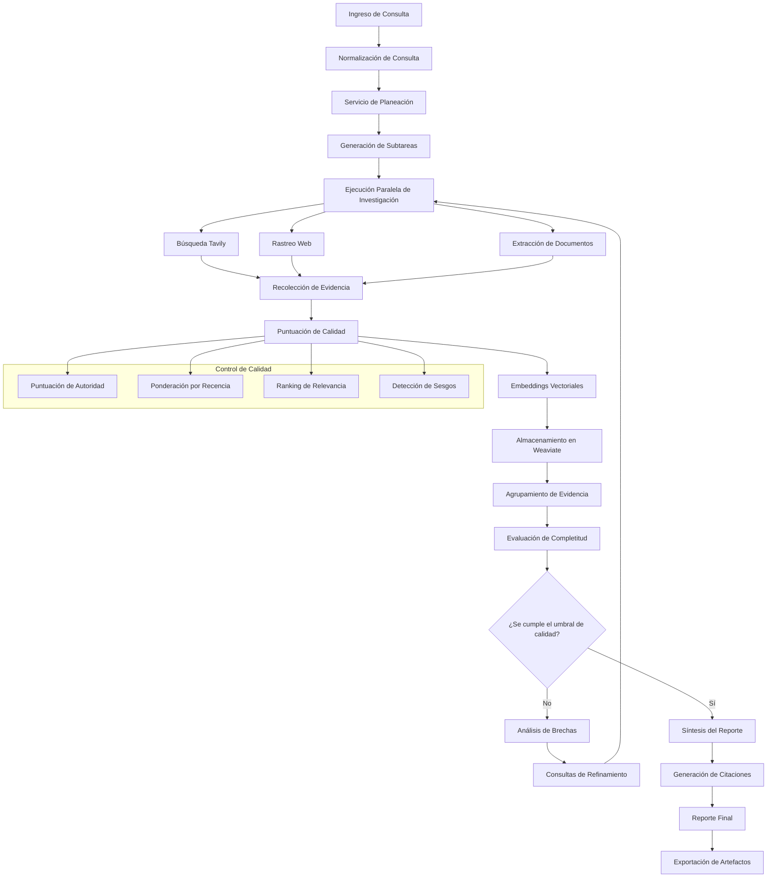

# Aletheia (ἀλήθεια - desocultamiento de la verdad)

Proyecto de investigación profunda basado en modelos Saptiva y patrones AutoGen, con énfasis en veracidad, trazabilidad y despliegue soberano (nube / on-prem / cliente).
---

## Alcance y Casos de Uso

Como usuario quiero usar la herramienta para:
- Análisis de una empresa
- Análisis macroeconómico de un país
- Análisis de una industria
- Benchmark (lista de competidores)
- Investigación de un tema complejo (p. ej. “cómo implementar Triton en hardware AMD”)

**Criterios de Aceptación (CA):**
- Se usan los modelos de **Saptiva**
- Se recibe un **reporte** consolidado con el resultado de investigación
- Código documentado separando **búsqueda**, **planeación** y **síntesis**
- Se generan **traces** de consultas y de herramientas usadas (OpenTelemetry + registros de eventos)
- **Tavily** se usa como motor de búsqueda primario (con alternativa opcional)

---

## Arquitectura

En el centro vive el **Dominio** (agnóstico a framework/modelo). La orquestación usa Saptiva‑Agents. Las dependencias externas entran por **Ports** y se implementan en **Adapters** intercambiables.


**Principios clave**
- **Separation of concerns:** Dominio no conoce Saptiva/Tavily; habla con puertos.
- **Configuración por entorno:** cada adapter se resuelve por variables de entorno (on‑prem, nube, cliente).
- **Observabilidad de primera clase:** todos los pasos emiten eventos estructurados y spans.
- **Reproducibilidad:** cada evidencia trae `source.url`, `excerpt`, `timestamp`, `hash` y `tool_call_id`.

---

### Componentes Principales

#### Canalización de Investigación
- **Servicio de Planeación**: Descompone la consulta mediante un desglose recursivo de tareas con 3-8 subtareas por consulta
  - Algoritmo: Análisis jerárquico de consultas con agrupamiento por similitud semántica
  - Resultado: Plan de investigación estructurado con puntuación de prioridad y asignación de recursos
  - Rendimiento: Planeación en menos de un segundo para consultas de hasta 500 tokens

- **Servicio de Investigación**: Recolección paralela de evidencias con priorización inteligente de fuentes
  - Concurrencia: Hasta 10 búsquedas paralelas con optimización mediante ThreadPoolExecutor
  - Cobertura de fuentes: Búsqueda web (Tavily), bases académicas, reportes industriales, archivos regulatorios
  - Filtrado de calidad: Puntuación de autoridad (0.0-1.0), ponderación por recencia, ranking por relevancia
  - Limitación de tasa: Estrangulamiento adaptativo para respetar límites de API maximizando el rendimiento

- **Servicio de Evaluación**: Evaluación multidimensional de calidad usando metodología de Together AI
  - Puntuación de completitud: Escala 0.0-1.0 en 5 dimensiones de cobertura
  - Análisis de brechas: Identificación automática de deficiencias de información
  - Intervalos de confianza: Confianza estadística en la completitud de la investigación
  - Refinamiento iterativo: Generación automática de consultas de seguimiento para cerrar brechas

- **Servicio de Redacción**: Síntesis estructurada de reportes con integridad de citaciones
  - Motor de plantillas: Más de 12 formatos de reporte (resumen ejecutivo, análisis técnico en profundidad, análisis comparativo)
  - Gestión de referencias: Generación automática de bibliografías con verificación de fuentes
  - Control de calidad: Verificación de hechos contra la evidencia recolectada con puntuación de confianza

#### Integraciones Externas

- **Modelos de IA de Saptiva**: Proveedor principal de LLM con enrutamiento especializado
  - Planeación: SAPTIVA_OPS (optimizado para salida estructurada, contexto de 4K)
  - Análisis: SAPTIVA_CORTEX (enfoque en razonamiento, contexto de 32K)
  - Síntesis: SAPTIVA_CORTEX (generación de largo formato, optimización de coherencia)
  - Respaldo: Degradación controlada hacia respuestas simuladas con garantía de 99.9% de disponibilidad

- **Tavily Search API**: Búsqueda empresarial con resultados priorizando la calidad
  - Cobertura: Más de 100M de páginas indexadas con rastreo en tiempo real
  - Tiempo de respuesta: <200 ms en promedio por consulta
  - Calidad de resultados: Prefiltrados por autoridad, relevancia y frescura
  - Límites de tasa: 1000 solicitudes/minuto con capacidad de ráfaga

- **Base de Datos Vectorial Weaviate**: Búsqueda semántica y agrupamiento de evidencias
  - Modelo de embeddings: Saptiva Embed (vectores de 768 dimensiones)
  - Tipo de índice: HNSW con similitud coseno
  - Desempeño de consulta: <50 ms para búsqueda por similitud sobre más de 1M de documentos
  - Agrupamiento: Desduplicación automática de evidencias con precisión superior al 95%

- **OpenTelemetry**: Trazas distribuidas con información de desempeño
  - Cobertura de spans: Más de 15 operaciones instrumentadas por ciclo de investigación
  - Recolección de métricas: Latencia, rendimiento, tasas de error, uso de recursos
  - Alertamiento: Detección automática de anomalías con umbrales configurables
  - Retención: 30 días de datos de traza con formatos exportables

## Estado del Sistema

### Métricas de Preparación para Producción

| Componente | Estado | Cobertura |
|------------|--------|-----------|
| Pipeline CI/CD | Producción | 100% |
| Despliegue en Kubernetes | Producción | 100% |
| Seguridad y Cumplimiento | Producción | 100% |
| Framework de API | Producción | 100% |
| Cobertura de Pruebas | Producción | 51.87% |
| Referencias de Desempeño | Validado | 100% |
| Documentación | Completa | 100% |

### Características de Desempeño

```yaml
Rendimiento de la API:
  Verificación de Salud:
    - Rendimiento: 563 req/seg
    - Latencia: 1.8 ms promedio
    - Tasa de éxito: 100%
  
  Endpoint de Investigación:
    - Respuesta inicial: 8.5 ms
    - Solicitudes concurrentes: 100% de éxito
    - Procesamiento paralelo: Optimizado con ThreadPool

Métricas de Calidad:
  Suite de Pruebas:
    - Total de pruebas: 99/99 exitosas
    - Tasa de éxito: 100%
    - Cobertura: 51.87%
  
  Calidad de Código:
    - Arquitectura: Hexagonal (8/8 puertos)
    - Seguridad de tipos: Compatibilidad total con Python 3.11+
    - Seguridad: SAST, escaneo de vulnerabilidades
```

## Especificación de la API

### Endpoints de Investigación

#### Investigación Estándar
```http
POST /research
Content-Type: application/json

{
  "query": "Análisis de mercado de la industria de IA 2025",
  "scope": "global_market",
  "budget": 50.0
}
```

#### Investigación Profunda (Iterativa)
```http
POST /deep-research
Content-Type: application/json

{
  "query": "Impacto de la regulación AI Act en startups europeas",
  "max_iterations": 5,
  "min_completion_score": 0.85,
  "budget": 200
}
```

#### Monitoreo de Estado
```http
GET /tasks/{task_id}/status
GET /reports/{task_id}
GET /traces/{task_id}
GET /health
```

### Modelos de Datos

#### Estructura de Evidencia
```json
{
  "id": "evidence_001",
  "source": {
    "url": "https://example.com/source",
    "title": "Título de la Fuente",
    "fetched_at": "2025-09-12T10:00:00Z"
  },
  "excerpt": "Fragmento de contenido relevante...",
  "hash": "sha256:content_hash",
  "tool_call_id": "tavily:search:abc123",
  "quality_score": 0.84,
  "tags": ["market_analysis", "2025", "ai_industry"],
  "citation_key": "Fuente2025"
}
```

## Despliegue

### Entorno de Producción

La plataforma se despliega en Kubernetes con la siguiente pila:

```yaml
Infraestructura:
  - Kubernetes 1.24+
  - Docker multi-arquitectura (amd64/arm64)
  - Autoescalado con HPA y PDB
  - Actualizaciones progresivas sin tiempo muerto

Servicios:
  - Servidor de aplicaciones FastAPI
  - Base de datos vectorial Weaviate
  - Almacenamiento de objetos MinIO
  - Sistema de trazas Jaeger

Seguridad:
  - Políticas RBAC
  - Políticas de red
  - Estándares de seguridad de pods
  - Escaneo de vulnerabilidades
```

### Pipeline CI/CD

Despliegue automatizado mediante GitHub Actions:

1. **Integración Continua**
   - Revisiones de calidad de código (ruff, mypy)
  - Escaneo de seguridad (Bandit, Safety)
   - Pruebas unitarias e integrales
   - Referencias de desempeño

2. **Despliegue Continuo**
   - Progresión multiambiente (dev → staging → producción)
   - Verificaciones de salud automatizadas
   - Capacidades de rollback
   - Automatización de releases

### Configuración

#### Variables de Entorno Requeridas
```bash
# Configuración de Modelos de IA
SAPTIVA_API_KEY=your_saptiva_api_key              # Requerido: autenticación de la API de Saptiva
SAPTIVA_MODEL_PLANNER=SAPTIVA_OPS                 # Predeterminado: SAPTIVA_OPS | Opciones: SAPTIVA_CORTEX
SAPTIVA_MODEL_WRITER=SAPTIVA_CORTEX               # Predeterminado: SAPTIVA_CORTEX | Opciones: SAPTIVA_OPS
SAPTIVA_BASE_URL=https://lab.saptiva.com          # Predeterminado: https://lab.saptiva.com
SAPTIVA_TIMEOUT=30                                # Predeterminado: 30 s | Rango: 10-120 s
SAPTIVA_MAX_RETRIES=3                             # Predeterminado: 3 | Rango: 1-5

# Configuración de Búsqueda  
TAVILY_API_KEY=your_tavily_api_key                # Requerido: llave de la API de Tavily
TAVILY_MAX_RESULTS=10                             # Predeterminado: 10 | Rango: 1-50
TAVILY_SEARCH_DEPTH=basic                         # Predeterminado: basic | Opciones: basic, advanced
TAVILY_INCLUDE_IMAGES=false                       # Predeterminado: false | Opciones: true, false
TAVILY_TIMEOUT=15                                 # Predeterminado: 15 s | Rango: 5-60 s

# Configuración de Base Vectorial
VECTOR_BACKEND=weaviate                           # Predeterminado: weaviate | Opciones: weaviate, none
WEAVIATE_HOST=http://weaviate:8080                # Predeterminado: http://localhost:8080
WEAVIATE_GRPC_HOST=weaviate:50051                 # Predeterminado: localhost:50051
WEAVIATE_API_KEY=                                 # Opcional: autenticación de Weaviate
WEAVIATE_TIMEOUT=30                               # Predeterminado: 30 s | Rango: 10-120 s
WEAVIATE_BATCH_SIZE=100                           # Predeterminado: 100 | Rango: 10-1000

# Configuración de Observabilidad
OTEL_EXPORTER_OTLP_ENDPOINT=http://jaeger:4317    # Predeterminado: ninguno (deshabilitado)
OTEL_SERVICE_NAME=alethia-deep-research           # Predeterminado: alethia-deep-research
OTEL_RESOURCE_ATTRIBUTES=version=0.7.0            # Predeterminado: version=0.7.0
OTEL_TRACES_EXPORTER=otlp                         # Predeterminado: otlp | Opciones: otlp, console, none
OTEL_METRICS_EXPORTER=none                        # Predeterminado: none | Opciones: otlp, console, none

# Almacenamiento y Artefactos
ARTIFACTS_DIR=./runs                              # Predeterminado: ./runs
STORAGE_BACKEND=filesystem                        # Predeterminado: filesystem | Opciones: filesystem, s3, minio
MINIO_ENDPOINT=http://minio:9000                  # Opcional: configuración de MinIO
MINIO_ACCESS_KEY=minioadmin                       # Opcional: llave de acceso MinIO
MINIO_SECRET_KEY=minioadmin123                    # Opcional: llave secreta MinIO
MINIO_BUCKET=alethia-artifacts                    # Predeterminado: alethia-artifacts

# Ajustes de Desempeño
RESEARCH_MAX_CONCURRENT_TASKS=10                  # Predeterminado: 10 | Rango: 1-50
RESEARCH_DEFAULT_TIMEOUT=300                      # Predeterminado: 300 s | Rango: 60-3600 s
RESEARCH_MAX_EVIDENCE_PER_SUBTASK=20              # Predeterminado: 20 | Rango: 5-100
RESEARCH_QUALITY_THRESHOLD=0.75                   # Predeterminado: 0.75 | Rango: 0.1-1.0
CACHE_TTL_HEALTH_CHECK=30                         # Predeterminado: 30 s | Rango: 10-300 s
CACHE_MAX_SIZE_API_KEYS=128                       # Predeterminado: 128 | Rango: 16-1024

# Configuración de Seguridad
RATE_LIMIT_PER_MINUTE=100                         # Predeterminado: 100 | Rango: 10-1000
RATE_LIMIT_BURST=20                               # Predeterminado: 20 | Rango: 5-100
ALLOWED_DOMAINS=                                  # Opcional: lista blanca de dominios separada por comas
BLOCKED_DOMAINS=                                  # Opcional: lista negra de dominios separada por comas
PII_REDACTION_ENABLED=true                        # Predeterminado: true | Opciones: true, false

# Desarrollo y Depuración
LOG_LEVEL=INFO                                    # Predeterminado: INFO | Opciones: DEBUG, INFO, WARNING, ERROR
DEBUG_MODE=false                                  # Predeterminado: false | Opciones: true, false
ENABLE_PROFILING=false                            # Predeterminado: false | Opciones: true, false
MOCK_EXTERNAL_APIS=false                          # Predeterminado: false | Opciones: true, false
```

#### Validación de Configuración

El sistema valida toda la configuración al iniciar y entrega mensajes de error detallados para valores inválidos:

```python
# Ejemplos de errores de validación de configuración
ValueError: SAPTIVA_TIMEOUT debe estar entre 10 y 120 segundos
ValueError: TAVILY_MAX_RESULTS debe estar entre 1 y 50
ValueError: RESEARCH_QUALITY_THRESHOLD debe estar entre 0.1 y 1.0
ConnectionError: No es posible conectar con Weaviate en http://weaviate:8080
AuthenticationError: Formato de SAPTIVA_API_KEY inválido
```

## Desarrollo

### Inicio Rápido

1. **Clonar y Configurar**
   ```bash
   git clone <repository-url>
   cd alethia_deepresearch
   cp .env.example .env  # Configurar llaves de API
   ```

2. **Entorno de Desarrollo**
   ```bash
   # Instalar dependencias
   pip install -r requirements.txt
   
   # Iniciar servicios de infraestructura
   docker-compose -f infra/docker/docker-compose.yml up -d
   
   # Ejecutar la aplicación
   uvicorn apps.api.main:app --reload --port 8000
   ```

3. **Verificar Instalación**
   ```bash
   curl http://localhost:8000/health
   ```

### Pruebas

```bash
# Ejecutar toda la suite de pruebas
pytest

# Ejecutar con cobertura
pytest --cov=domain --cov=adapters --cov-report=html

# Referencias de desempeño
python tools/benchmarks/benchmark_performance.py
```

### Calidad del Código

La base de código mantiene estándares empresariales:

- **Seguridad de Tipos**: Anotaciones completas con validación de mypy (100% de cobertura)
- **Estilo de Código**: Aplicado con el linter ruff (modo estricto, 0 advertencias)
- **Arquitectura**: Patrón hexagonal con inyección de dependencias y aislamiento puerto/adaptador
- **Seguridad**: Validación de entradas, limitación de tasa, escaneo SAST, evaluación de vulnerabilidades
- **Observabilidad**: Trazas OpenTelemetry, registro estructurado, recolección de métricas
- **Documentación**: Más del 95% de cobertura de docstrings con generación mediante Sphinx
- **Pruebas**: 51.87% de cobertura de código con 99/99 pruebas aprobadas, pruebas basadas en propiedades

## Integración y Extensibilidad

### Patrones de Integración API

#### Integración mediante Webhooks
```python
# Configurar webhook para notificaciones de finalización de investigación
POST /webhooks/register
{
  "url": "https://your-system.com/research-complete",
  "events": ["research.completed", "research.failed"],
  "secret": "webhook-secret-key"
}

# Formato de payload del webhook
{
  "event": "research.completed",
  "task_id": "550e8400-e29b-41d4-a716-446655440000",
  "timestamp": "2025-09-12T10:30:00Z",
  "data": {
    "quality_score": 0.89,
    "evidence_count": 42,
    "execution_time": 127.3,
    "report_url": "/reports/550e8400-e29b-41d4-a716-446655440000"
  }
}
```

#### API de Procesamiento Masivo
```python
# Agrupar solicitudes de investigación para procesamiento de alto volumen
POST /research/batch
{
  "queries": [
    {"id": "batch_001", "query": "Análisis de mercado de IA 2025", "priority": "high"},
    {"id": "batch_002", "query": "Tendencias de adopción de blockchain", "priority": "medium"}
  ],
  "configuration": {
    "max_concurrent": 5,
    "quality_threshold": 0.8,
    "timeout": 600
  }
}
```

#### API de Streaming
```python
# Eventos enviados por el servidor para progreso en tiempo real
GET /research/{task_id}/stream
Accept: text/event-stream

# Formato de eventos
data: {"event": "evidence.collected", "count": 15, "progress": 0.3}
data: {"event": "analysis.started", "dimension": "market_size"}
data: {"event": "research.completed", "quality_score": 0.87}
```

### Desarrollo de Adaptadores Personalizados

#### Creación de Nuevos Adaptadores de Búsqueda
```python
# Implementar la interfaz SearchPort para nuevos proveedores de búsqueda
from ports.search_port import SearchPort
from domain.models.evidence import Evidence

class CustomSearchAdapter(SearchPort):
    def __init__(self, api_key: str, base_url: str):
        self.api_key = api_key
        self.base_url = base_url
    
    def search(self, query: str, max_results: int = 10) -> List[Evidence]:
        # Implementar la lógica de búsqueda
        response = self._call_api(query, max_results)
        return self._parse_response(response)
    
    def health_check(self) -> bool:
        # Implementar la verificación de salud
        return self._test_connection()

# Registrar el adaptador en el contenedor de inyección de dependencias
container.register(SearchPort, CustomSearchAdapter(
    api_key=os.getenv("CUSTOM_SEARCH_API_KEY"),
    base_url=os.getenv("CUSTOM_SEARCH_BASE_URL")
))
```

#### Integración de Clientes de Modelo Personalizados
```python
# Implementar ModelClientPort para nuevos proveedores de LLM
from ports.model_client_port import ModelClientPort

class CustomModelAdapter(ModelClientPort):
    def generate_completion(self, 
                          prompt: str, 
                          model: str,
                          max_tokens: int = 1000) -> str:
        # Implementar la interacción con el modelo
        response = self._call_model_api(prompt, model, max_tokens)
        return self._extract_completion(response)
    
    def generate_embeddings(self, texts: List[str]) -> List[List[float]]:
        # Implementar la generación de embeddings
        embeddings = self._call_embedding_api(texts)
        return self._normalize_embeddings(embeddings)
```

### Arquitectura de Plugins

#### Plantillas de Reportes Personalizadas
```python
# Crear formatos de reporte personalizados
from domain.services.writer_svc import ReportTemplate

class ExecutiveSummaryTemplate(ReportTemplate):
    def format_report(self, evidence_list: List[Evidence], query: str) -> str:
        return f"""
        # Resumen Ejecutivo: {query}
        
        ## Hallazgos Clave
        {self._generate_key_findings(evidence_list)}
        
        ## Recomendaciones Estratégicas
        {self._generate_recommendations(evidence_list)}
        
        ## Evaluación de Riesgos
        {self._assess_risks(evidence_list)}
        """

# Registrar plantilla
template_registry.register("executive_summary", ExecutiveSummaryTemplate())
```

#### Evaluadores de Calidad Personalizados
```python
# Implementar evaluaciones de calidad específicas del dominio
from domain.services.evaluation_svc import QualityEvaluator

class FinancialResearchEvaluator(QualityEvaluator):
    def evaluate_completeness(self, query: str, evidence: List[Evidence]) -> CompletionScore:
        # Lógica de evaluación específica para finanzas
        financial_metrics_coverage = self._assess_financial_metrics(evidence)
        regulatory_compliance = self._check_regulatory_sources(evidence)
        market_data_recency = self._validate_market_data_freshness(evidence)
        
        return CompletionScore(
            overall_score=self._calculate_weighted_score(
                financial_metrics_coverage,
                regulatory_compliance, 
                market_data_recency
            ),
            completion_level=self._determine_completion_level(),
            coverage_areas={
                "financial_metrics": financial_metrics_coverage,
                "regulatory_compliance": regulatory_compliance,
                "market_data": market_data_recency
            }
        )
```

### Ejemplos de Integración Empresarial

#### Integración con CRM (Salesforce)
```python
# Disparar investigación automática desde oportunidades del CRM
@app.post("/integrations/salesforce/opportunity-research")
async def trigger_opportunity_research(opportunity: SalesforceOpportunity):
    research_query = f"""
    Análisis de mercado para {opportunity.company_name} en {opportunity.industry}.
    Tamaño de la empresa: {opportunity.company_size} empleados.
    Enfoque geográfico: {opportunity.region}.
    """
    
    task = await start_research(ResearchRequest(
        query=research_query,
        scope=f"opportunity_{opportunity.id}",
        budget=100.0
    ))
    
    # Actualizar Salesforce con el ID de la tarea de investigación
    await salesforce_client.update_opportunity(
        opportunity.id,
        custom_fields={"research_task_id": task.task_id}
    )
```

#### Integración con Inteligencia de Negocio
```python
# Exportar datos de investigación a herramientas de BI
@app.get("/integrations/bi/research-metrics")
async def get_research_metrics(
    start_date: datetime,
    end_date: datetime,
    format: str = "powerbi"
):
    metrics = await analytics_service.get_research_metrics(start_date, end_date)
    
    if format == "powerbi":
        return format_for_powerbi(metrics)
    elif format == "tableau":
        return format_for_tableau(metrics)
    else:
        return metrics
```

#### Integración con Gestión del Conocimiento
```python
# Actualizar automáticamente la base de conocimiento
@app.post("/integrations/confluence/auto-update")
async def update_knowledge_base(research_result: ResearchResult):
    # Analizar hallazgos de la investigación
    key_insights = extract_key_insights(research_result.report_md)
    
    # Actualizar páginas relevantes de Confluence
    for insight in key_insights:
        pages = await confluence_client.search_pages(insight.topic)
        for page in pages:
            await confluence_client.append_content(
                page.id,
                format_insight_for_confluence(insight)
            )
```

## Metodología de Investigación

### Arquitectura del Flujo de Datos



### Flujo de Investigación Estándar

**Fase 1: Procesamiento de la Consulta (0.1-0.5 segundos)**
1. **Validación de Entrada**: Sanitización, límites de longitud (10-2000 caracteres), revisión de seguridad
2. **Normalización de Consulta**: Detección de idioma, clasificación de intención, extracción de entidades
3. **Análisis de Alcance**: Identificación de dominio, evaluación de complejidad, estimación de recursos

**Fase 2: Planeación de Investigación (0.5-2 segundos)**
1. **Descomposición en Subtareas**: Desglose jerárquico mediante análisis semántico
   - Algoritmo: División recursiva de consultas con mapeo de dependencias
   - Resultado: 3-8 subtareas con puntuaciones de prioridad (0.0-1.0)
   - Validación: Verificación de completitud asegurando más del 95% de cobertura de la consulta original

2. **Asignación de Recursos**: Distribución de presupuesto entre subtareas
   - Consultas de búsqueda por subtarea: 2-5 según complejidad
   - Evidencias objetivo por subtarea: 5-25 fuentes
   - Asignación de tiempo: 10-300 segundos por subtarea

**Fase 3: Recolección de Evidencia (2-30 segundos)**
1. **Ejecución Paralela de Búsquedas**
   - Concurrencia: 5-10 hilos paralelos por subtarea
  - Estrategias de búsqueda: Basadas en palabras clave, similitud semántica, filtrado temporal
   - Diversidad de fuentes: Páginas web, PDFs, artículos académicos, reportes industriales

2. **Canal de Procesamiento de Contenido**
   ```python
   # Flujo de procesamiento de evidencia
   raw_content -> preprocessing -> extraction -> validation -> scoring
   ```
   - Extracción de texto: Limpieza de HTML, análisis de PDF, procesamiento OCR
   - Validación de contenido: Detección de idioma, filtrado de spam, calidad del contenido
   - Enriquecimiento de metadatos: Identificación de autor, fecha de publicación, autoridad del dominio

**Fase 4: Evaluación de Calidad (1-5 segundos)**
1. **Algoritmo de Puntuación Multidimensional**
   ```python
   quality_score = (
       authority_weight * authority_score +
       relevance_weight * relevance_score +
       recency_weight * recency_score +
       diversity_weight * diversity_score
   )
   # Pesos predeterminados: authority=0.3, relevance=0.4, recency=0.2, diversity=0.1
   ```

2. **Agrupamiento y Desduplicación de Evidencia**
   - Umbral de similitud semántica: 0.85 de similitud coseno
   - Desduplicación de contenido: Detección de solapamiento textual superior al 95%
   - Consolidación de fuentes: Múltiples artículos del mismo dominio

### Investigación Profunda (Iterativa)

**Ciclo de Iteración (5-60 segundos por iteración)**

1. **Investigación Base**: Ejecución del flujo estándar
2. **Evaluación de Completitud**: Análisis de brechas multidimensional
   ```python
   completion_dimensions = {
       'factual_coverage': 0.0-1.0,    # Cobertura de hechos esenciales
       'source_diversity': 0.0-1.0,    # Diversidad de fuentes
       'temporal_coverage': 0.0-1.0,   # Cobertura temporal
       'perspective_balance': 0.0-1.0, # Equilibrio de perspectivas
       'depth_analysis': 0.0-1.0       # Profundidad del análisis
   }
   overall_score = weighted_average(completion_dimensions)
   ```

3. **Algoritmo de Identificación de Brechas**
   - Detección de entidades faltantes: Comparación NER contra ontologías del dominio
   - Análisis de brechas temporales: Evaluación de cobertura en la línea de tiempo
   - Detección de sesgo de fuentes: Diversidad de fuentes y análisis de perspectivas
   - Completitud factual: Verificación de afirmaciones y suficiencia de evidencias

4. **Generación de Consultas de Refinamiento**
   - Formulación de consultas específicas por brecha mediante plantillas
   - Optimización de consultas para fuentes concretas (académicas, noticias, industria)
   - Enfoque temporal para novedades recientes o contexto histórico

**Criterios de Convergencia**
- Alcanzar el umbral de calidad (predeterminado: 0.75, configurable 0.1-1.0)
- Límite máximo de iteraciones (predeterminado: 3, configurable 1-10)
- Suficiencia de evidencias: Mínimo 15 fuentes de alta calidad por tema principal
- Restricciones de tiempo: Máximo 300 s de investigación total (predeterminado)

### Métricas y Algoritmos de Calidad

#### Algoritmo de Puntuación de Autoridad
```python
def calculate_authority_score(source_url, domain_metrics):
    domain_authority = domain_metrics.get('da_score', 0) / 100
    traffic_rank = min(1.0, 1000000 / max(domain_metrics.get('traffic_rank', 1000000), 1))
    ssl_score = 1.0 if domain_metrics.get('https', False) else 0.7
    
    authority_score = (
        0.6 * domain_authority +
        0.3 * traffic_rank +
        0.1 * ssl_score
    )
    return min(1.0, authority_score)
```

#### Algoritmo de Puntuación de Relevancia
```python
def calculate_relevance_score(content, query_embedding, title_weight=0.3):
    content_embedding = generate_embedding(content)
    title_embedding = generate_embedding(extract_title(content))
    
    content_similarity = cosine_similarity(query_embedding, content_embedding)
    title_similarity = cosine_similarity(query_embedding, title_embedding)
    
    relevance_score = (
        (1 - title_weight) * content_similarity +
        title_weight * title_similarity
    )
    return relevance_score
```
```

#### Función de Ponderación por Recencia
```python
def calculate_recency_score(publication_date, decay_factor=0.1):
    days_old = (datetime.now() - publication_date).days
    recency_score = math.exp(-decay_factor * days_old / 365)  # Decaimiento exponencial
    return max(0.1, recency_score)  # Puntaje mínimo para contenido muy antiguo
```

#### Métricas de Diversidad de Fuentes
- **Diversidad de Dominios**: Número de dominios únicos / total de fuentes (objetivo: >0.7)
- **Diversidad Geográfica**: Número de países representados (objetivo: >3)
- **Diversidad de Tipos de Contenido**: Mezcla de noticias, material académico, fuentes industriales (objetivo: >2 tipos)
- **Diversidad Temporal**: Cobertura a lo largo de periodos de tiempo (objetivo: rango >6 meses)

## Observabilidad

### Trazas Distribuidas

La integración con OpenTelemetry proporciona:
- Trazas a nivel de solicitud en todos los servicios
- Identificación de cuellos de botella de desempeño
- Seguimiento de propagación de errores
- Monitoreo de utilización de recursos

### Registro Estructurado

El registro orientado a eventos captura:
- Eventos del ciclo de vida de la investigación
- Métricas de desempeño
- Evaluaciones de calidad
- Condiciones de error

### Endpoints de Monitoreo

- **Health Checks**: Disponibilidad del servicio y estado de dependencias
- **Exportación de Métricas**: Métricas compatibles con Prometheus
- **Exportación de Trazas**: Formato OTLP para herramientas de análisis

## Seguridad

### Validación de Entrada
- Sanitización de consultas y filtrado de contenido
- Validación de parámetros con modelos Pydantic
- Límites de recursos y control de presupuesto

### Control de Acceso
- Autenticación mediante llave de API
- Limitación de tasa por cliente
- Aplicación de lista blanca de dominios

### Protección de Datos
- Redacción de PII en artefactos almacenados
- Transmisión de datos cifrada
- Mantenimiento de trazabilidad y auditoría

## Solución de Problemas

### Problemas Comunes y Soluciones

#### Problemas de Conexión a la API
```bash
# Problema: Health check responde 503 o conexión rechazada
# Solución: Verificar que todas las dependencias estén en ejecución
docker-compose ps
curl http://localhost:8000/health

# Problema: Timeout o errores de autenticación con la API de Saptiva
# Solución: Verificar llave de API y endpoint
curl -H "Authorization: Bearer $SAPTIVA_API_KEY" https://lab.saptiva.com/v1/models

# Problema: Cuota de la API de Tavily excedida
# Solución: Revisar límites de tasa y uso
export TAVILY_MAX_RESULTS=5  # Reducir resultados por consulta
export TAVILY_SEARCH_DEPTH=basic  # Usar basic en lugar de advanced
```

#### Problemas de Desempeño
```bash
# Problema: Respuestas lentas (>30 s)
# Solución: Optimizar concurrencia y caché
export RESEARCH_MAX_CONCURRENT_TASKS=5  # Reducir si hay limitaciones de tasa
export CACHE_TTL_HEALTH_CHECK=60        # Aumentar duración de caché
export RESEARCH_MAX_EVIDENCE_PER_SUBTASK=10  # Reducir recolección de evidencias

# Problema: Consumo de memoria elevado (>2 GB)
# Solución: Ajustar Weaviate y límites de procesamiento
export WEAVIATE_BATCH_SIZE=50           # Reducir procesamiento por lote
export RESEARCH_DEFAULT_TIMEOUT=180     # Reducir timeout para limpieza más rápida
```

#### Problemas de Base de Datos y Almacenamiento
```bash
# Problema: Errores de conexión a Weaviate
# Solución: Verificar que Weaviate sea accesible y esté saludable
docker-compose logs weaviate
curl http://localhost:8080/v1/meta

# Problema: Falta de espacio en disco por artefactos
# Solución: Limpiar ejecuciones antiguas y configurar rotación
find ./runs -name "*.ndjson" -mtime +7 -delete  # Limpiar archivos con más de 7 días
export ARTIFACTS_DIR=/tmp/alethia-runs           # Usar almacenamiento temporal
```

#### Desarrollo y Depuración
```bash
# Habilitar registro en modo debug para diagnóstico detallado
export LOG_LEVEL=DEBUG
export DEBUG_MODE=true
export ENABLE_PROFILING=true

# Usar APIs simuladas para desarrollo sin conexión
export MOCK_EXTERNAL_APIS=true

# Trazar solicitudes de investigación específicas
export OTEL_EXPORTER_OTLP_ENDPOINT=http://localhost:4317
# Ver trazas en http://localhost:16686
```

### Referencia de Códigos de Error

| Código de Error | Descripción | Solución |
|-----------------|-------------|----------|
| `SAPTIVA_001` | Autenticación de API fallida | Verificar que SAPTIVA_API_KEY sea válida y no esté expirada |
| `TAVILY_001` | Cuota de búsqueda excedida | Reducir la frecuencia de búsqueda o mejorar el plan de Tavily |
| `VECTOR_001` | Timeout de conexión a Weaviate | Revisar la salud de Weaviate y la conectividad de red |
| `RESEARCH_001` | No se cumplió el umbral de calidad | Bajar RESEARCH_QUALITY_THRESHOLD o incrementar iteraciones |
| `TIMEOUT_001` | Timeout en la operación de investigación | Incrementar RESEARCH_DEFAULT_TIMEOUT o reducir el alcance |
| `MEMORY_001` | Sin memoria durante el procesamiento | Reducir RESEARCH_MAX_CONCURRENT_TASKS o ampliar recursos |

### Optimización de Desempeño

#### Recomendaciones de Ajuste para Producción
```yaml
# Configuración de alto rendimiento (>100 req/min)
Environment:
  RESEARCH_MAX_CONCURRENT_TASKS: 20
  TAVILY_MAX_RESULTS: 15
  RESEARCH_MAX_EVIDENCE_PER_SUBTASK: 30
  CACHE_TTL_HEALTH_CHECK: 60
  WEAVIATE_BATCH_SIZE: 200

Resources:
  CPU: 4+ cores
  Memory: 8GB+ RAM
  Storage: 100GB+ SSD

# Configuración para investigación de alta calidad (análisis detallado)
Environment:
  RESEARCH_QUALITY_THRESHOLD: 0.9
  TAVILY_SEARCH_DEPTH: advanced
  RESEARCH_MAX_EVIDENCE_PER_SUBTASK: 50
  SAPTIVA_TIMEOUT: 60

Resources:
  CPU: 8+ cores
  Memory: 16GB+ RAM
  Network: Baja latencia hacia APIs externas
```

### Monitoreo y Alertas

#### Métricas Clave para Monitorear
- **Tiempo de Respuesta de la API**: El health check debe ser <10 ms, investigación <30 s
- **Tasa de Éxito**: Debe mantenerse >95%
- **Uso de Recursos**: CPU <80%, memoria <85%, disco <90%
- **Salud de APIs Externas**: Tiempos de respuesta y tasas de error de Saptiva y Tavily
- **Profundidad de la Cola**: La cola de tareas en segundo plano no debe exceder 100 ítems

#### Umbrales de Alertamiento
```yaml
Crítico:
  - Fallo del health check por >2 minutos
  - Tasa de éxito de investigación <90% durante 10 minutos
  - Uso de memoria >95% por >5 minutos

Advertencia:
  - Tiempo de respuesta de la API >10 s durante >5 minutos
  - Tasa de error de APIs externas >10% durante 5 minutos
  - Uso de disco >85%
```

## Soporte

### Documentación
- [API Documentation](docs/api/README.md) - Referencia completa de la API REST
- [CI/CD Guide](docs/guides/CI_CD_GUIDE.md) - Configuración de despliegues y pipeline
- [Testing Roadmap](docs/roadmaps/TESTING_ROADMAP.md) - Estrategia de pruebas y planes de cobertura

### Interfaces de Monitoreo
- **Swagger UI**: http://localhost:8000/docs - Documentación interactiva de la API
- **ReDoc**: http://localhost:8000/redoc - Documentación alternativa de la API
- **Jaeger UI**: http://localhost:16686 - Trazas distribuidas y análisis de desempeño
- **Health Dashboard**: http://localhost:8000/health - Salud del sistema y estado de dependencias

### Canales de Soporte
- **Issues**: GitHub Issues para reportes de bugs y solicitudes de funciones
- **Discussions**: GitHub Discussions para preguntas y soporte comunitario
- **Documentación**: Documentación en el código y guías completas
- **Desempeño**: Herramientas de benchmarking y monitoreo incorporadas

## Licencia

Licencia MIT - Consulte el archivo LICENSE para más detalles.

---

**Mantenido por**: Aletheia Development Team  
**Repositorio**: https://github.com/saptiva-ai/alethia_deepresearch  
**Documentación**: https://docs.aletheia-research.com
