# Aletheia (ἀλήθεια – desocultamiento de la verdad)

Aletheia es una plataforma de investigación asistida por agentes que separa claramente el
*Dominio* de la orquestación y de las integraciones externas. El objetivo del repositorio es
ofrecer un pipeline reproducible para planear, ejecutar y sintetizar investigaciones
aprovechando modelos de lenguaje de Saptiva y fuentes externas (Tavily, documentos locales,
vector stores, etc.).

> **Estado:** proyecto en evolución. Muchas piezas son prototipos y los pipelines de CI pueden
> fallar si el entorno local no está alineado (por ejemplo, ruff o pytest sin instalar el
> paquete). Este README describe cómo dejar todo funcionando de forma consistente.

---

## Qué incluye el repositorio

- `apps/api`: aplicación FastAPI que expone endpoints de investigación y salud.
- `domain`: reglas de negocio (planificación, evaluación, orquestación iterativa y modelos).
- `adapters`: integraciones concretas (Saptiva, Tavily, extracción de documentos, telemetría,
  almacenamiento vectorial, etc.).
- `ports`: interfaces que definen contratos entre el dominio y los adapters.
- `infra/docker`: docker-compose y scripts para levantar dependencias opcionales (Weaviate,
  MinIO, Jaeger, etc.).
- `tests`: suites unitarias e integrales (separadas en `tests/unit` y `tests/integration`).
- `docs`: material de referencia y diagramas adicionales.

---

## Requisitos

- Python 3.11 o superior.
- `pip` y `virtualenv` para aislar dependencias.
- Opcional: Tesseract OCR, Docker y Docker Compose si se van a probar los adapters de OCR o
  el stack completo.

---

## Configuración rápida

1. Clonar el repositorio y crear un entorno virtual:
   ```bash
   git clone <repository-url>
   cd alethia_deepresearch
   python -m venv .venv
   source .venv/bin/activate  # Windows: .venv\Scripts\activate
   ```
2. Instalar dependencias y registrar el paquete en modo editable (evita los errores
   `ModuleNotFoundError` al ejecutar pruebas):
   ```bash
   pip install --upgrade pip
   pip install -r requirements.txt
   pip install -e .
   ```
3. Definir variables de entorno mínimas (puedes partir de `.env.example`):
   ```bash
   cp .env.example .env
   # Edita .env con las llaves de SAPTIVA_API_KEY y TAVILY_API_KEY cuando uses servicios reales
   ```

---

## Ejecutar la API local

```bash
uvicorn apps.api.main:app --reload --port 8000
```

Con Docker Compose existe un stack completo en `infra/docker`. Revisa
`infra/docker/README.md` para levantar únicamente las dependencias o todo el sistema.

---

## Pruebas y calidad de código

Las GitHub Actions ejecutan los mismos pasos. Reprodúcelos localmente antes de subir cambios:

```bash
# Formato y estilo
ruff check .
black --check .

# Tipado estático
mypy domain/models --ignore-missing-imports

# Pruebas unitarias con cobertura (requiere pip install -e .)
# El pipeline actual valida un mínimo de 50% de cobertura.
pytest tests/unit/ -v --cov=domain --cov=adapters --cov=apps --cov-report=term-missing

# Pruebas de integración (requiere Weaviate activo, ver docker-compose)
pytest tests/integration/ -v
```

Bandit y Safety también forman parte del pipeline (`bandit -r domain/ adapters/ apps/` y
`safety check`). Ambos se permiten fallar en CI, pero conviene revisar los reportes generados en
`bandit-report.json` y `safety-report.json` cuando existan hallazgos.

---

## Pipeline CI/CD (GitHub Actions)

Archivo principal: `.github/workflows/ci.yml`.

1. **Tests (`tests/unit`)**: instala dependencias y ejecuta pytest en Python 3.11 y 3.12 con
   cobertura mínima del 50% (configurable). Exporta `coverage.xml`/`htmlcov`. Asegúrate de tener
   el paquete instalado (`pip install -e .`) para reproducirlo en local.
2. **Lint**: `black --check`, `ruff check`, `mypy domain/models`, `bandit` y `safety`.
3. **Integration**: levanta un servicio de Weaviate y lanza `pytest tests/integration`.
4. **Build**: construye y smoke-testea la imagen Docker de la API.
5. **Security**: escaneo con Trivy (se sube el resultado como SARIF).

Cuando un job falla, el archivo `cicd.err` concentra el resumen de errores. El fallo reportado
recientemente provenía de `ruff` (regla `UP007` por anotaciones `Union`/`Optional` y `UP035`
por tipos de `typing`). Ajusta las anotaciones a la sintaxis de Python 3.11 (`str | Path`,
`list[...]`, etc.) y vuelve a ejecutar `ruff check adapters/extractor/pdf_extractor.py` para
confirmar.

---

## Arquitectura (vista rápida)

El dominio se mantiene independiente de frameworks y proveedores externos. Los adapters se
registran a través de puertos, lo que simplifica sustituir proveedores o ejecutar el sistema en
modos degradados.

```mermaid
flowchart LR
  subgraph Domain[Dominio]
    T(ResearchTask)
    Plan
    Evidence
    Citation
    Report
    P[Planner]
    R[Researcher]
    C[Curator]
    F[FactChecker]
    W[Writer]
    X[Critic]
  end

  subgraph Ports[Ports]
    MP[ModelClientPort]
    SP[SearchPort]
    VP[VectorStorePort]
    BP[BrowserPort]
    DP[DocExtractPort]
    GP[GuardPort]
    LP[LoggingPort]
    STP[StoragePort]
  end

  subgraph Adapters[Adapters]
    MA[Saptiva Model Client]
    TA[Tavily API]
    WA[Weaviate DB]
    SA[Multimodal Web Surfer]
    DA[PDF/OCR Extractor]
    GA[Saptiva Guard]
    OA[OpenTelemetry + Event Logs]
    FS[MinIO/S3/FS]
  end

  Domain --> Ports
  Ports --> Adapters
```



---

## Recursos adicionales

- `docs/`: notas de diseño y ejemplos ampliados.
- `scripts/`: utilidades para crear planes, depurar o importar datos.
- Issues/discusiones: usa GitHub para coordinar trabajo pendiente (roadmap, bugs, etc.).

---

## Licencia

MIT. Consulta `LICENSE` para más detalles.
