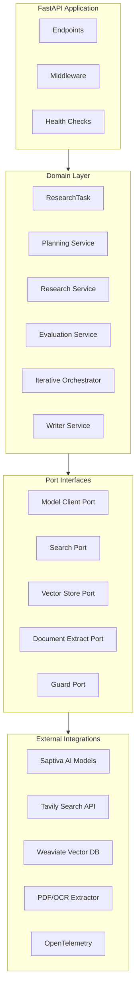
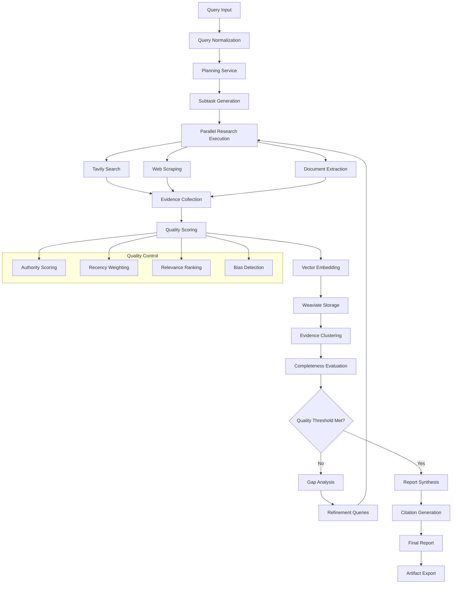

# Aletheia (ἀλήθεια – desocultamiento de la verdad)

[](https://opensource.org/licenses/Apache-2.0)
[](https://www.docker.com/)
[](https://nodejs.org/)
[](https://www.python.org/)
[](https://www.python.org/downloads/)

Aletheia es una plataforma de investigación asistida por agentes que separa claramente el
*Dominio* de la orquestación y de las integraciones externas. El objetivo del repositorio es
ofrecer un pipeline reproducible para planear, ejecutar y sintetizar investigaciones
aprovechando modelos de lenguaje de Saptiva y fuentes externas (Tavily, documentos locales, etc.).

> **Estado:** ✅ **En producción** - API completamente operativa, configuración minimalista, deployment simplificado.

> 📝 **¿Vienes de una versión anterior?** El proyecto ha sido simplificado para setup instantáneo. Ver [SIMPLIFICATION.md](SIMPLIFICATION.md) para detalles de los cambios y guía de migración.

## 🎯 Configuración Minimalista

Este proyecto está optimizado para un **setup simple y directo**:

✅ **Solo 2 API Keys requeridas**: Saptiva + Tavily
✅ **Sin dependencias de servicios externos**: Sin bases de datos, sin contenedores obligatorios
✅ **Python 3.11+ como único requisito** del sistema
✅ **Docker opcional**: Funciona perfectamente sin contenedores
✅ **Zero config**: Valores por defecto listos para producción

**Tiempo de setup:** < 5 minutos desde cero

---

## 🚀 Enlaces Rápidos

- **[Configuración Rápida](#-configuración-rápida)**: Setup en < 5 minutos
- **[API Docs](http://localhost:8000/docs)**: Swagger UI interactivo (cuando el servidor esté corriendo)
- **[Health Check](http://localhost:8000/health)**: Verificar estado del sistema
- **[Deployment](#-deployment)**: Guías de despliegue
- **[Arquitectura](#-arquitectura)**: Diseño del sistema
- **[SIMPLIFICATION.md](SIMPLIFICATION.md)**: Guía de la configuración minimalista

---

## 📦 Qué incluye el repositorio

- **`apps/api`**: Aplicación FastAPI que expone endpoints de investigación y salud
- **`domain`**: Reglas de negocio (planificación, evaluación, orquestación iterativa y modelos)
- **`adapters`**: Integraciones concretas (Saptiva, Tavily, extracción de documentos, telemetría, almacenamiento vectorial, etc.)
- **`ports`**: Interfaces que definen contratos entre el dominio y los adapters
- **`infra`**: Infraestructura como código (Docker, Kubernetes)
- **`scripts`**: Scripts de deployment y utilidades de desarrollo
- **`tests`**: Suites unitarias e integrales (99 tests, cobertura 23%+)
- **`docs`**: Material de referencia y diagramas adicionales

---

## 🛠 Requisitos Mínimos

### Esenciales (Requeridos)
- **Python 3.11+** ⚠️ **REQUERIDO** - El proyecto usa sintaxis moderna de Python
- **pip** y **virtualenv** para gestión de dependencias
- **API Keys**:
  - Saptiva AI: [Obtener key](https://saptiva.ai)
  - Tavily Search: [Obtener key](https://tavily.com)

### Opcionales (No requeridos por defecto)
- **Docker** - Solo para deployment en contenedores
- **Weaviate** - Solo si activas vector database (`VECTOR_BACKEND=weaviate`)
- **Tesseract OCR** - Solo para procesamiento OCR de imágenes
- **Jaeger** - Solo para trazabilidad distribuida avanzada

> **Nota importante**: El sistema funciona completamente sin ningún servicio externo. La configuración minimalista es ideal para desarrollo y producción.

### Verificar Python 3.11

⚠️ **IMPORTANTE**: Verifica tu versión de Python antes de continuar:

```bash
python3.11 --version  # Debe mostrar Python 3.11.x o superior
```

**Si no tienes Python 3.11:**

```bash
# Ubuntu/Debian
sudo apt update && sudo apt install python3.11 python3.11-venv python3.11-dev

# macOS (Homebrew)
brew install python@3.11
```

---

## ⚡ Configuración Rápida

### 1. Clonar y configurar entorno

⚠️ **IMPORTANTE: Usa `python3.11` explícitamente en todos los comandos**

```bash
git clone https://github.com/saptiva-ai/alethia_deepresearch.git
cd alethia_deepresearch

# Crear entorno virtual con Python 3.11
python3.11 -m venv .venv

# Activar entorno virtual
source .venv/bin/activate  # Windows: .venv\Scripts\activate

# Verificar que estás usando Python 3.11
python --version  # Debe mostrar Python 3.11.x
```

### 2. Instalar dependencias

```bash
pip install --upgrade pip
pip install -r requirements.txt
pip install -e .[dev]  # Incluye herramientas de desarrollo
```

### 3. Configurar variables de entorno

```bash
cp .env.example .env
```

Edita `.env` con tus API keys:

```bash
# === REQUERIDO ===
SAPTIVA_API_KEY=tu_clave_saptiva_aqui
TAVILY_API_KEY=tu_clave_tavily_aqui

# === Configuración predeterminada (ya configurada) ===
SAPTIVA_BASE_URL=https://api.saptiva.com/v1
VECTOR_BACKEND=none
ENVIRONMENT=development
```

**Nota**: Los demás valores ya tienen defaults apropiados. Solo necesitas las API keys.

### 4. Verificar configuración (opcional pero recomendado)

```bash
# Ejecutar script de verificación
./scripts/check_python_version.sh
```

### 5. Ejecutar la API

```bash
# Asegúrate de que el entorno virtual esté activado
python --version  # Debe mostrar Python 3.11.x

# Ejecutar el servidor
uvicorn apps.api.main:app --reload --port 8000
```

🎉 **API disponible en:** http://localhost:8000/docs

**Notas importantes:**
- ✅ El servidor usa **modo minimalista** por defecto (sin Weaviate, sin servicios externos)
- ✅ Si obtienes errores de sintaxis como `TypeError: unsupported operand type(s) for |`, estás usando Python < 3.10
- ✅ Los warnings de Pydantic son normales y no afectan la funcionalidad

---

## 🧪 Pruebas y Calidad de Código

El proyecto mantiene estándares profesionales con CI/CD automatizado:

### Ejecutar verificaciones localmente

```bash
# Linting y formato
ruff check .
ruff check . --fix  # Corregir problemas automáticamente

# Type checking
mypy domain/models --ignore-missing-imports

# Tests unitarios (99 tests, sin servicios externos)
pytest tests/unit/ -v --cov=domain --cov=adapters --cov=apps --cov-report=term-missing

# Tests de integración (requiere configurar API keys)
pytest tests/integration/ -v
```

### Pipeline CI/CD Automatizado

El repositorio incluye verificaciones completas en cada push:

- ✅ **Linting**: Ruff para calidad de código
- ✅ **Type checking**: MyPy para validación de tipos
- ✅ **Testing**: 99 unit tests con 23%+ cobertura
- ✅ **Security**: Bandit + Safety para análisis de seguridad
- ✅ **Build**: Docker multi-stage optimizado
- ✅ **Deploy**: Automatización a staging/producción

Ver `.github/workflows/ci.yml` para configuración completa.

---

## 🚀 Deployment

### Opción 1: Docker Compose (Recomendado para producción) ✅

El método más simple y rápido:

```bash
# 1. Configurar variables de entorno
cp .env.example .env
# Edita .env con tus API keys (Saptiva + Tavily)

# 2. Iniciar el servicio
docker-compose up -d

# 3. Verificar estado
curl http://localhost:8000/health
```

**Acceso:**
- API: http://localhost:8000
- Documentación interactiva: http://localhost:8000/docs
- Redoc: http://localhost:8000/redoc

### Opción 2: Docker Build Manual

```bash
# Build
docker build -t aletheia-api .

# Run
docker run -d \
  --name aletheia-api \
  -p 8000:8000 \
  --env-file .env \
  aletheia-api
```

### Opción 3: Servidor Directo (SSH)

Para servidores con acceso SSH:

```bash
# En el servidor remoto
git clone https://github.com/saptiva-ai/alethia_deepresearch.git
cd alethia_deepresearch
python3.11 -m venv .venv
source .venv/bin/activate
pip install -r requirements.txt
cp .env.example .env
# Edita .env con tus keys

# Ejecutar con systemd o supervisord
uvicorn apps.api.main:app --host 0.0.0.0 --port 8000 --workers 4
```

### Configuración de Producción

Ajustes recomendados para entornos de producción:

```bash
# === API Keys (REQUERIDAS) ===
SAPTIVA_API_KEY=your_production_key
TAVILY_API_KEY=your_production_key

# === Configuración de producción ===
ENVIRONMENT=production
DEBUG=false
LOG_LEVEL=WARNING
API_RELOAD=false

# === Servicios opcionales (deshabilitados por defecto) ===
VECTOR_BACKEND=none  # Cambiar a 'weaviate' solo si lo necesitas
```

**Nota**: El sistema funciona perfectamente sin servicios adicionales (Weaviate, Jaeger, etc.).

---

## 📡 API Endpoints

### Core Research Endpoints

| Endpoint | Method | Descripción | Tiempo estimado |
|----------|--------|-------------|-----------------|
| `/health` | GET | Health check con status de APIs | < 1s |
| `/research` | POST | Investigación simple optimizada | 30-60s |
| `/deep-research` | POST | Investigación profunda iterativa | 2-5 min |
| `/tasks/{task_id}/status` | GET | Estado de tarea en curso | < 1s |
| `/reports/{task_id}` | GET | Reporte final generado | < 1s |
| `/traces/{task_id}` | GET | Trazas de telemetría | < 1s |

### 🚀 Guía de Inicio Rápido

#### 1. Verificar que el sistema esté funcionando

```bash
# Health check - verifica que la API esté corriendo
curl http://localhost:8000/health

# Respuesta esperada
{
  "status": "healthy",
  "service": "Aletheia Deep Research API",
  "version": "0.2.0",
  "api_keys": {
    "saptiva_available": true,
    "tavily_available": true
  }
}
```

#### 2. Investigación Simple (Recomendado para comenzar)

**Características:**
- ✅ Rápida (30-60 segundos)
- ✅ Procesamiento paralelo
- ✅ Ideal para consultas directas

```bash
# Iniciar investigación
curl -X POST "http://localhost:8000/research" \
  -H "Content-Type: application/json" \
  -d '{
    "query": "Últimas tendencias en inteligencia artificial 2025"
  }'

# Respuesta
{
  "task_id": "550e8400-e29b-41d4-a716-446655440000",
  "status": "accepted",
  "details": "Research task has been accepted and is running..."
}

# Verificar estado (espera ~30 segundos)
curl "http://localhost:8000/tasks/550e8400-e29b-41d4-a716-446655440000/status"

# Cuando status="completed", obtener el reporte
curl "http://localhost:8000/reports/550e8400-e29b-41d4-a716-446655440000"
```

#### 3. Investigación Profunda (Deep Research)

**Características:**
- 🔄 Iterativa con refinamiento automático
- 📊 Evaluación de completitud
- 🎯 Identificación de brechas de información
- ⚙️ Parámetros configurables

```bash
# Iniciar investigación profunda
curl -X POST "http://localhost:8000/deep-research" \
  -H "Content-Type: application/json" \
  -d '{
    "query": "Impacto de la regulación AI Act en startups europeas",
    "max_iterations": 3,
    "min_completion_score": 0.85,
    "budget": 200
  }'

# Respuesta
{
  "task_id": "deep-550e8400-e29b-41d4-a716-446655440000",
  "status": "accepted",
  "details": "Deep research task accepted with parallel processing..."
}

# Obtener reporte con métricas de calidad
curl "http://localhost:8000/deep-research/deep-550e8400-e29b-41d4-a716-446655440000"
```

**Parámetros de Deep Research:**

| Parámetro | Tipo | Descripción | Default | Rango |
|-----------|------|-------------|---------|-------|
| `query` | string | Consulta de investigación | - | Requerido |
| `max_iterations` | int | Máximo de iteraciones | 3 | 1-10 |
| `min_completion_score` | float | Score mínimo para finalizar | 0.75 | 0.1-1.0 |
| `budget` | int | Presupuesto total | 100 | 1-5000 |

### 📋 Casos de Uso Prácticos

#### Caso 1: Análisis de Mercado

```bash
curl -X POST "http://localhost:8000/research" \
  -H "Content-Type: application/json" \
  -d '{
    "query": "Análisis del mercado de fintech en México 2025: principales competidores, regulación y tendencias"
  }'
```

**Tiempo estimado:** 45 segundos
**Fuentes típicas:** 10-15 artículos

#### Caso 2: Due Diligence Tecnológico

```bash
curl -X POST "http://localhost:8000/deep-research" \
  -H "Content-Type: application/json" \
  -d '{
    "query": "Evaluación técnica de frameworks de IA: PyTorch vs TensorFlow vs JAX",
    "max_iterations": 5,
    "min_completion_score": 0.90
  }'
```

**Tiempo estimado:** 4-5 minutos
**Fuentes típicas:** 40-60 documentos

#### Caso 3: Investigación Académica

```bash
curl -X POST "http://localhost:8000/deep-research" \
  -H "Content-Type: application/json" \
  -d '{
    "query": "Estado del arte en modelos de lenguaje multimodales: arquitecturas, benchmarks y aplicaciones",
    "max_iterations": 7,
    "budget": 300
  }'
```

**Tiempo estimado:** 6-8 minutos
**Fuentes típicas:** 60-100 papers y artículos

### 🔍 Monitoreo de Tareas

#### Workflow completo con bash

```bash
#!/bin/bash
# Script para ejecutar y monitorear una investigación

# 1. Iniciar investigación
RESPONSE=$(curl -s -X POST "http://localhost:8000/research" \
  -H "Content-Type: application/json" \
  -d '{"query": "Tu consulta aquí"}')

# 2. Extraer task_id
TASK_ID=$(echo $RESPONSE | jq -r '.task_id')
echo "Task ID: $TASK_ID"

# 3. Monitorear estado
while true; do
  STATUS=$(curl -s "http://localhost:8000/tasks/$TASK_ID/status" | jq -r '.status')
  echo "Status: $STATUS"

  if [ "$STATUS" == "completed" ]; then
    break
  fi

  sleep 5
done

# 4. Obtener reporte
curl -s "http://localhost:8000/reports/$TASK_ID" | jq -r '.report_md' > report.md
echo "Reporte guardado en report.md"
```

### 📊 Respuestas de la API

#### Formato de Reporte de Investigación Simple

```json
{
  "status": "completed",
  "report_md": "# Título del Reporte\n\n## Resumen Ejecutivo\n...",
  "sources_bib": "Generated from 15 evidence sources",
  "metrics_json": "{\"mock_metric\": 1.0}"
}
```

#### Formato de Reporte de Deep Research

```json
{
  "status": "completed",
  "report_md": "# Análisis Profundo\n\n...",
  "sources_bib": "Generated from 42 evidence sources",
  "research_summary": {
    "iterations_completed": 3,
    "gaps_identified": ["regulatory_compliance", "market_impact"],
    "key_findings": [
      "High compliance costs",
      "Market consolidation likely"
    ]
  },
  "quality_metrics": {
    "completion_level": 0.95,
    "quality_score": 0.88,
    "evidence_count": 42,
    "execution_time": 127.3
  }
}
```

### 🛠 Testing y Troubleshooting

#### Test Rápido de APIs

```bash
# Ejecutar suite de tests
python3 tools/testing/test_apis.py

# Test individual de Saptiva
python3 tools/testing/test_saptiva_direct.py
```

#### Problemas Comunes

**Error: "API key not configured"**
```bash
# Verificar que las keys estén configuradas
cat .env | grep API_KEY

# Deben estar presentes y no contener valores placeholder
```

**Error: "Timeout" o "Connection Error"**
```bash
# Verificar configuración de timeouts en .env
SAPTIVA_CONNECT_TIMEOUT=30
SAPTIVA_READ_TIMEOUT=120
```

**La API no responde**
```bash
# Verificar que el servidor esté corriendo
curl http://localhost:8000/health

# Si no responde, iniciar servidor
uvicorn apps.api.main:app --reload
```

---

## 🏗 Arquitectura

### Vista general



### Flujo de investigación





### Principios de diseño

- **🏛 Clean Architecture**: Separación clara entre dominio, puertos y adapters
- **🔌 Dependency Inversion**: Abstracciones estables, implementaciones intercambiables
- **🧪 Testability**: 99 unit tests, mocking de dependencias externas
- **⚡ Performance**: Procesamiento paralelo, optimizaciones asíncronas
- **🛡 Resilience**: Graceful degradation, retry mechanisms, modo fallback
- **🎯 Simplicity**: Configuración minimalista, servicios externos opcionales

**Modo Minimalista por defecto:**
- Vector storage opera en modo mock (sin Weaviate)
- Evidence se almacena en memoria durante la sesión
- No hay impacto en rendimiento del pipeline de investigación
- Todas las funcionalidades operan normalmente

---

## 🔧 Desarrollo

### Estructura del proyecto

```
alethia_deepresearch/
├── apps/                    # FastAPI application
│   └── api/
├── domain/                  # Business logic (clean architecture)
│   ├── models/             # Domain models
│   └── services/           # Domain services
├── adapters/               # External integrations
│   ├── saptiva_model/      # Saptiva AI integration
│   ├── tavily_search/      # Tavily search integration
│   ├── weaviate_vector/    # Vector database
│   └── telemetry/          # Observability
├── ports/                  # Interface contracts
├── tests/                  # Test suites
│   ├── unit/              # Unit tests (99 tests)
│   └── integration/       # Integration tests
├── scripts/               # Deployment & utility scripts
│   └── deployment/        # Deployment automation
├── infra/                 # Infrastructure as code
│   ├── docker/           # Docker Compose
│   └── k8s/              # Kubernetes manifests
└── docs/                  # Documentation
```

### Scripts disponibles

```bash
# Verificación de Python
./scripts/check_python_version.sh      # Verificar Python 3.11+

# Deployment scripts
./scripts/deployment/setup-server.sh   # Configurar servidor remoto
./scripts/deployment/deploy-remote.sh  # Deploy via SSH
./scripts/deployment/deploy-docker.sh  # Deploy con Docker local
./scripts/deployment/deploy.sh         # Deploy general
```

### Configuración de desarrollo

```bash
# Pre-commit hooks (recomendado)
pip install pre-commit
pre-commit install

# Variables de desarrollo
export DEBUG=true
export LOG_LEVEL=DEBUG
export ENVIRONMENT=development
```

---

## 📊 Monitoreo y Observabilidad

### Health Check

El endpoint de salud proporciona información completa del sistema:

```bash
curl http://localhost:8000/health
```

**Respuesta:**
```json
{
  "status": "healthy",
  "service": "Aletheia Deep Research API",
  "version": "0.2.0",
  "api_keys": {
    "saptiva_available": true,
    "tavily_available": true
  }
}
```

### Logs Estructurados

El sistema incluye logging completo sin dependencias externas:

- **Formato**: Console output estructurado (JSON opcional)
- **Niveles**: DEBUG, INFO, WARNING, ERROR
- **Task IDs**: Tracking automático de todas las requests
- **Timestamps**: Información temporal precisa

### Observabilidad Avanzada (100% Opcional)

Si necesitas trazabilidad distribuida o métricas detalladas:

```bash
# 1. Instalar dependencias opcionales
pip install -r requirements-optional.txt

# 2. Habilitar servicios en docker-compose.yml
# (Descomentar secciones de Jaeger/OpenTelemetry)

# 3. Configurar en .env
OTEL_EXPORTER_OTLP_ENDPOINT=http://localhost:4317
```

**Nota**: La configuración minimalista incluye OpenTelemetry básico sin servicios externos.

---

## 🤝 Contribuir

### Workflow de desarrollo

1. **Fork** el repositorio
2. **Crear branch** para feature/fix: `git checkout -b feature/amazing-feature`
3. **Commit** cambios: `git commit -m 'Add amazing feature'`
4. **Push** a branch: `git push origin feature/amazing-feature`
5. **Crear Pull Request**

### Estándares de código

- ✅ **Linting**: Código debe pasar `ruff check`
- ✅ **Format**: Usar `ruff check --fix` para auto-format
- ✅ **Types**: Type hints obligatorios
- ✅ **Tests**: Tests unitarios para nuevas features
- ✅ **Docs**: Actualizar README.md si es necesario

### Revisión de código

- CI/CD debe pasar (99 tests, linting, security)
- Revisión por al menos 1 maintainer
- Documentación actualizada si aplica

---

## 📚 Recursos Adicionales

### Documentación

- **[API Reference](http://localhost:8000/docs)**: Swagger UI interactivo con ejemplos
- **[ReDoc](http://localhost:8000/redoc)**: Documentación alternativa de la API
- **[Documentación técnica](docs/)**: Guías detalladas y ejemplos en el directorio docs/
- **[SIMPLIFICATION.md](SIMPLIFICATION.md)**: Guía de la configuración minimalista

### Enlaces Útiles

- **[GitHub Issues](https://github.com/saptiva-ai/alethia_deepresearch/issues)**: Reportar bugs o solicitar features
- **[GitHub Discussions](https://github.com/saptiva-ai/alethia_deepresearch/discussions)**: Preguntas y discusiones
- **[Releases](https://github.com/saptiva-ai/alethia_deepresearch/releases)**: Historial de versiones

---

## 📄 Licencia

Apache License 2.0 - ver [LICENSE](LICENSE) para más detalles.

Copyright 2025 Saptiva Inc.

---

## 🙏 Agradecimientos

- **Saptiva AI** - Modelos de lenguaje de vanguardia
- **Tavily** - Search API para investigación
- **FastAPI** - Framework web moderno y rápido
- **Weaviate** - Vector database escalable

---

<div align="center">

**¿Encontraste útil este proyecto? ⭐ Danos una estrella!**

[Reportar Bug](https://github.com/saptiva-ai/alethia_deepresearch/issues) · [Solicitar Feature](https://github.com/saptiva-ai/alethia_deepresearch/issues) · [Documentación](docs/)

</div>
