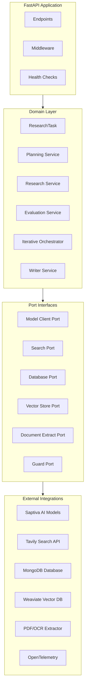
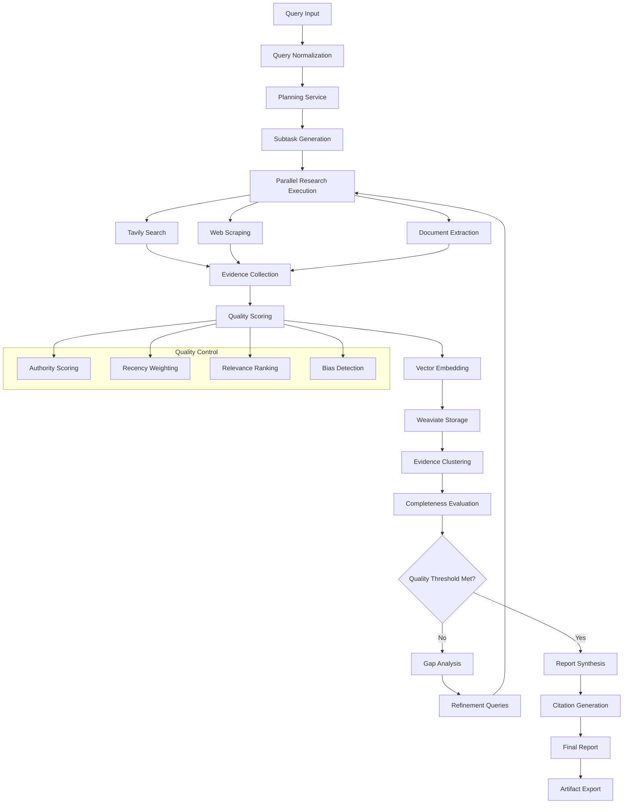

# Aletheia (ἀλήθεια – desocultamiento de la verdad)

[](https://opensource.org/licenses/Apache-2.0)
[](https://www.docker.com/)
[](https://nodejs.org/)
[](https://www.python.org/)
[](https://www.python.org/downloads/)

Aletheia es una plataforma de investigación asistida por agentes que separa claramente el
*Dominio* de la orquestación y de las integraciones externas. El objetivo del repositorio es
ofrecer un pipeline reproducible para planear, ejecutar y sintetizar investigaciones
aprovechando modelos de lenguaje de Saptiva y fuentes externas (Tavily, documentos locales, etc.).

> **Estado:** ✅ **En producción** - API completamente operativa, configuración minimalista, deployment simplificado.

> 📝 **¿Vienes de una versión anterior?** El proyecto ha sido simplificado para setup instantáneo. Ver [SIMPLIFICATION.md](SIMPLIFICATION.md) para detalles de los cambios y guía de migración.

---

## 🆕 ¿Primera vez usando Aletheia?

👉 **Lee primero [QUICKSTART.md](QUICKSTART.md)** - Guía paso a paso de 5 minutos que te llevará de cero a tu primera investigación funcionando.

El QUICKSTART incluye:
- ✅ Setup completo paso a paso
- ✅ Verificación automática del sistema
- ✅ Ejemplos de uso inmediatos
- ✅ Solución de problemas comunes

---

## 🎯 Configuración Minimalista

Este proyecto está optimizado para un **setup simple y directo**:

✅ **Solo 2 API Keys requeridas**: Saptiva + Tavily
✅ **MongoDB integrado**: Almacenamiento persistente para tareas, reportes y logs
✅ **Python 3.11+ como único requisito** del sistema (modo local)
✅ **Docker opcional**: Funciona localmente sin contenedores
✅ **Zero config**: Valores por defecto listos para producción

**Tiempo de setup:** < 5 minutos desde cero

### 💾 Almacenamiento de Datos

- **Con MongoDB (Recomendado)**: Persistencia completa de tareas, reportes y logs
- **Sin MongoDB (Fallback)**: Almacenamiento en memoria (se pierde al reiniciar)
- **Producción**: MongoDB obligatorio para multi-worker y persistencia

---

## 🚀 Enlaces Rápidos

- **[⚡ QUICKSTART.md](QUICKSTART.md)**: ¡Empieza aquí! Guía de 5 minutos para nuevos usuarios
- **[Configuración Rápida](#-configuración-rápida)**: Setup en < 5 minutos
- **[Verificar Sistema](#-verificar-instalación)**: Script de prueba completo
- **[API Docs](http://localhost:8000/docs)**: Swagger UI interactivo (cuando el servidor esté corriendo)
- **[Health Check](http://localhost:8000/health)**: Verificar estado del sistema
- **[Deployment](#-deployment)**: Guías de despliegue
- **[Arquitectura](#-arquitectura)**: Diseño del sistema
- **[SIMPLIFICATION.md](SIMPLIFICATION.md)**: Guía de la configuración minimalista

---

## 📦 Qué incluye el repositorio

- **`apps/api`**: Aplicación FastAPI que expone endpoints de investigación y salud
- **`domain`**: Reglas de negocio (planificación, evaluación, orquestación iterativa y modelos)
- **`adapters`**: Integraciones concretas (Saptiva, Tavily, extracción de documentos, telemetría, almacenamiento vectorial, etc.)
- **`ports`**: Interfaces que definen contratos entre el dominio y los adapters
- **`infra`**: Infraestructura como código (Docker, Kubernetes)
- **`scripts`**: Scripts de deployment y utilidades de desarrollo
- **`tests`**: Suites unitarias e integrales (99 tests, cobertura 23%+)
- **`docs`**: Material de referencia y diagramas adicionales

---

## 🛠 Requisitos Mínimos

### Esenciales (Requeridos)
- **Python 3.11+** ⚠️ **REQUERIDO** - El proyecto usa sintaxis moderna de Python
- **pip** y **virtualenv** para gestión de dependencias
- **API Keys**:
  - Saptiva AI: [Obtener key](https://saptiva.ai)
  - Tavily Search: [Obtener key](https://tavily.com)

### Opcionales (No requeridos por defecto)
- **Docker + Docker Compose** - Para deployment con contenedores y MongoDB integrado
- **MongoDB 7.0+** - Para almacenamiento persistente (recomendado para producción)
- **Weaviate** - Solo si activas vector database (`VECTOR_BACKEND=weaviate`)
- **Tesseract OCR** - Solo para procesamiento OCR de imágenes
- **Jaeger** - Solo para trazabilidad distribuida avanzada

> **Nota importante**: El sistema funciona completamente sin servicios externos para desarrollo. Para producción se recomienda MongoDB para persistencia de datos.

### Verificar Python 3.11

⚠️ **IMPORTANTE**: Verifica tu versión de Python antes de continuar:

```bash
python3.11 --version  # Debe mostrar Python 3.11.x o superior
```

**Si no tienes Python 3.11:**

```bash
# Ubuntu/Debian
sudo apt update && sudo apt install python3.11 python3.11-venv python3.11-dev

# macOS (Homebrew)
brew install python@3.11
```

---

## ⚡ Configuración Rápida

Existen dos modos de configuración:

- **🚀 Modo Contenedor (Recomendado)**: Incluye MongoDB, fácil deployment, producción ready
- **💻 Modo Local**: Desarrollo rápido sin Docker, usa almacenamiento en memoria

### Opción A: Modo Contenedor (Con MongoDB) 🚀

**Ventajas:**
- ✅ MongoDB integrado para persistencia
- ✅ Configuración lista para producción
- ✅ Fácil escalamiento
- ✅ Datos persisten entre reinicios

```bash
# 1. Clonar repositorio
git clone https://github.com/saptiva-ai/alethia_deepresearch.git
cd alethia_deepresearch

# 2. Configurar variables de entorno
cp .env.example .env
# Edita .env con tus API keys (Saptiva + Tavily)

# 3. Iniciar servicios con Docker Compose
docker-compose up -d

# 4. Verificar estado
curl http://localhost:8000/health
docker logs aletheia-api
docker logs aletheia-mongodb

# 5. Ver documentación interactiva
# Abre en tu navegador: http://localhost:8000/docs
```

**Servicios levantados:**
- API: http://localhost:8000 (contenedor `aletheia-api`)
- MongoDB: localhost:27018 (contenedor `aletheia-mongodb`)
- Volúmenes persistentes: `mongodb_data`, `mongodb_config`

**Comandos útiles:**
```bash
# Ver logs en tiempo real
docker-compose logs -f api

# Reiniciar servicios
docker-compose restart

# Detener servicios
docker-compose down

# Detener y eliminar datos
docker-compose down -v
```

---

### Opción B: Modo Local (Sin Docker) 💻

**Ventajas:**
- ✅ Setup más rápido
- ✅ No requiere Docker
- ✅ Ideal para desarrollo
- ⚠️ Sin persistencia de datos (usa memoria)

### 1. Clonar y configurar entorno

⚠️ **IMPORTANTE: Usa `python3.11` explícitamente en todos los comandos**

```bash
git clone https://github.com/saptiva-ai/alethia_deepresearch.git
cd alethia_deepresearch

# Crear entorno virtual con Python 3.11
python3.11 -m venv .venv

# Activar entorno virtual
source .venv/bin/activate  # Windows: .venv\Scripts\activate

# Verificar que estás usando Python 3.11
python --version  # Debe mostrar Python 3.11.x
```

### 2. Instalar dependencias

```bash
pip install --upgrade pip
pip install -r requirements.txt
pip install -e .[dev]  # Incluye herramientas de desarrollo
```

### 3. Configurar variables de entorno

```bash
cp .env.example .env
```

Edita `.env` con tus API keys:

```bash
# === REQUERIDO ===
SAPTIVA_API_KEY=tu_clave_saptiva_aqui
TAVILY_API_KEY=tu_clave_tavily_aqui

# === Configuración predeterminada (ya configurada) ===
SAPTIVA_BASE_URL=https://api.saptiva.com/v1
VECTOR_BACKEND=none
ENVIRONMENT=development

# === MongoDB (Opcional - Solo para persistencia local) ===
# Descomenta estas líneas solo si tienes MongoDB instalado localmente
# MONGODB_URL=mongodb://localhost:27017
# MONGODB_DATABASE=aletheia

# Nota: Las líneas de Docker Compose (mongodb://...@mongodb:27017)
# NO funcionan en modo local. Solo usar en Docker Compose.
```

**Notas:**
- Los demás valores ya tienen defaults apropiados
- Solo necesitas las API keys para comenzar
- MongoDB es opcional en modo local (usa almacenamiento en memoria si no está configurado)

### 4. Verificar configuración (opcional pero recomendado)

```bash
# Ejecutar script de verificación
./scripts/check_python_version.sh
```

### 5. Ejecutar la API

```bash
# Asegúrate de que el entorno virtual esté activado
python --version  # Debe mostrar Python 3.11.x

# Ejecutar el servidor
uvicorn apps.api.main:app --reload --port 8000
```

🎉 **API disponible en:** http://localhost:8000/docs

**Notas importantes:**
- ✅ El servidor usa **modo minimalista** por defecto (sin Weaviate, sin servicios externos)
- ✅ Si obtienes errores de sintaxis como `TypeError: unsupported operand type(s) for |`, estás usando Python < 3.10
- ✅ Los warnings de Pydantic son normales y no afectan la funcionalidad

### 6. Verificar Instalación

Ejecuta el script de verificación completo del sistema:

```bash
python tools/verify_system.py
```

Este script verifica:
- ✅ Variables de entorno configuradas correctamente
- ✅ API corriendo y saludable
- ✅ Endpoint `/research` funcionando (investigación simple)
- ✅ Endpoint `/deep-research` funcionando (investigación profunda con WebSocket)
- ✅ Guardado de reportes en MongoDB (si está configurado)
- ✅ Trazabilidad completa del sistema

**Salida esperada:**
```
🔍 VERIFICACIÓN COMPLETA DEL SISTEMA ALETHEIA

1️⃣  VERIFICACIÓN DE VARIABLES DE ENTORNO
✅ PASS - SAPTIVA_API_KEY configurada
✅ PASS - TAVILY_API_KEY configurada
✅ PASS - MONGODB_URL configurada

2️⃣  VERIFICACIÓN DE API
✅ PASS - API Health Check
✅ PASS - API Version

3️⃣  VERIFICACIÓN DE INVESTIGACIÓN SIMPLE (/research)
✅ PASS - Iniciar Research
✅ PASS - Research Completado
✅ PASS - Reporte Generado
✅ PASS - Fuentes Documentadas

4️⃣  VERIFICACIÓN DE DEEP RESEARCH CON WEBSOCKET
✅ PASS - Iniciar Deep Research
✅ PASS - WebSocket Connection
✅ PASS - Deep Research Completado
✅ PASS - Reporte Generado
✅ PASS - Métricas de Calidad

5️⃣  VERIFICACIÓN DE ALMACENAMIENTO (MONGODB)
✅ PASS - Conexión a MongoDB
✅ PASS - Collection: tasks
✅ PASS - Collection: reports

📋 RESUMEN FINAL
Tests ejecutados: 20
✅ Pasados: 20
❌ Fallados: 0

🎉 ¡TODOS LOS TESTS PASARON! El sistema está funcionando correctamente.
```

Si todos los tests pasan, **¡estás listo para usar Aletheia!** 🚀

---

## 🧪 Pruebas y Calidad de Código

El proyecto mantiene estándares profesionales con CI/CD automatizado:

### Ejecutar verificaciones localmente

```bash
# Linting y formato
ruff check .
ruff check . --fix  # Corregir problemas automáticamente

# Type checking
mypy domain/models --ignore-missing-imports

# Tests unitarios (99 tests, sin servicios externos)
pytest tests/unit/ -v --cov=domain --cov=adapters --cov=apps --cov-report=term-missing

# Tests de integración (requiere configurar API keys)
pytest tests/integration/ -v
```

### Pipeline CI/CD Automatizado

El repositorio incluye verificaciones completas en cada push:

- ✅ **Linting**: Ruff para calidad de código
- ✅ **Type checking**: MyPy para validación de tipos
- ✅ **Testing**: 99 unit tests con 23%+ cobertura
- ✅ **Security**: Bandit + Safety para análisis de seguridad
- ✅ **Build**: Docker multi-stage optimizado
- ✅ **Deploy**: Automatización a staging/producción

Ver `.github/workflows/ci.yml` para configuración completa.

---

## 🚀 Deployment

### Opción 1: Docker Compose (Recomendado para producción) ✅

El método más simple y rápido:

```bash
# 1. Configurar variables de entorno
cp .env.example .env
# Edita .env con tus API keys (Saptiva + Tavily)

# 2. Iniciar el servicio
docker-compose up -d

# 3. Verificar estado
curl http://localhost:8000/health
```

**Acceso:**
- API: http://localhost:8000
- Documentación interactiva: http://localhost:8000/docs
- Redoc: http://localhost:8000/redoc

### Opción 2: Docker Build Manual

```bash
# Build
docker build -t aletheia-api .

# Run
docker run -d \
  --name aletheia-api \
  -p 8000:8000 \
  --env-file .env \
  aletheia-api
```

### Opción 3: Servidor Directo (SSH)

Para servidores con acceso SSH:

```bash
# En el servidor remoto
git clone https://github.com/saptiva-ai/alethia_deepresearch.git
cd alethia_deepresearch
python3.11 -m venv .venv
source .venv/bin/activate
pip install -r requirements.txt
cp .env.example .env
# Edita .env con tus keys

# Ejecutar con systemd o supervisord
uvicorn apps.api.main:app --host 0.0.0.0 --port 8000 --workers 4
```

### Configuración de Producción

Ajustes recomendados para entornos de producción:

```bash
# === API Keys (REQUERIDAS) ===
SAPTIVA_API_KEY=your_production_key
TAVILY_API_KEY=your_production_key

# === Configuración de producción ===
ENVIRONMENT=production
DEBUG=false
LOG_LEVEL=WARNING
API_RELOAD=false

# === Servicios opcionales (deshabilitados por defecto) ===
VECTOR_BACKEND=none  # Cambiar a 'weaviate' solo si lo necesitas
```

**Nota**: El sistema funciona perfectamente sin servicios adicionales (Weaviate, Jaeger, etc.).

---

## 📡 API Endpoints

### Core Research Endpoints

| Endpoint | Method | Descripción | Tiempo estimado |
|----------|--------|-------------|-----------------|
| `/health` | GET | Health check con status de APIs | < 1s |
| `/research` | POST | Investigación simple optimizada | 30-60s |
| `/deep-research` | POST | Investigación profunda iterativa | 2-5 min |
| `/tasks/{task_id}/status` | GET | Estado de tarea en curso | < 1s |
| `/reports/{task_id}` | GET | Reporte final generado | < 1s |
| `/traces/{task_id}` | GET | Trazas de telemetría | < 1s |
| `/ws/progress/{task_id}` | WebSocket | **Actualizaciones en tiempo real** | Streaming |

### 🚀 Guía de Inicio Rápido

#### 1. Verificar que el sistema esté funcionando

```bash
# Health check - verifica que la API esté corriendo
curl http://localhost:8000/health

# Respuesta esperada
{
  "status": "healthy",
  "service": "Aletheia Deep Research API",
  "version": "0.2.0",
  "api_keys": {
    "saptiva_available": true,
    "tavily_available": true
  }
}
```

#### 2. Investigación Simple (Recomendado para comenzar)

**Características:**
- ✅ Rápida (30-60 segundos)
- ✅ Procesamiento paralelo
- ✅ Ideal para consultas directas

```bash
# Iniciar investigación
curl -X POST "http://localhost:8000/research" \
  -H "Content-Type: application/json" \
  -d '{
    "query": "Últimas tendencias en inteligencia artificial 2025"
  }'

# Respuesta
{
  "task_id": "550e8400-e29b-41d4-a716-446655440000",
  "status": "accepted",
  "details": "Research task has been accepted and is running..."
}

# Verificar estado (espera ~30 segundos)
curl "http://localhost:8000/tasks/550e8400-e29b-41d4-a716-446655440000/status"

# Cuando status="completed", obtener el reporte
curl "http://localhost:8000/reports/550e8400-e29b-41d4-a716-446655440000"
```

#### 3. Investigación Profunda (Deep Research)

**Características:**
- 🔄 Iterativa con refinamiento automático
- 📊 Evaluación de completitud
- 🎯 Identificación de brechas de información
- ⚙️ Parámetros configurables
- 📡 **Actualizaciones en tiempo real via WebSocket**

```bash
# Iniciar investigación profunda
curl -X POST "http://localhost:8000/deep-research" \
  -H "Content-Type: application/json" \
  -d '{
    "query": "Impacto de la regulación AI Act en startups europeas",
    "max_iterations": 3,
    "min_completion_score": 0.85,
    "budget": 200
  }'

# Respuesta
{
  "task_id": "deep-550e8400-e29b-41d4-a716-446655440000",
  "status": "accepted",
  "details": "Deep research task accepted with parallel processing..."
}

# Obtener reporte con métricas de calidad
curl "http://localhost:8000/deep-research/deep-550e8400-e29b-41d4-a716-446655440000"
```

**Parámetros de Deep Research:**

| Parámetro | Tipo | Descripción | Default | Rango |
|-----------|------|-------------|---------|-------|
| `query` | string | Consulta de investigación | - | Requerido |
| `max_iterations` | int | Máximo de iteraciones | 3 | 1-10 |
| `min_completion_score` | float | Score mínimo para finalizar | 0.75 | 0.1-1.0 |
| `budget` | int | Presupuesto total | 100 | 1-5000 |

### 📋 Casos de Uso Prácticos

#### Caso 1: Análisis de Mercado

```bash
curl -X POST "http://localhost:8000/research" \
  -H "Content-Type: application/json" \
  -d '{
    "query": "Análisis del mercado de fintech en México 2025: principales competidores, regulación y tendencias"
  }'
```

**Tiempo estimado:** 45 segundos
**Fuentes típicas:** 10-15 artículos

#### Caso 2: Due Diligence Tecnológico

```bash
curl -X POST "http://localhost:8000/deep-research" \
  -H "Content-Type: application/json" \
  -d '{
    "query": "Evaluación técnica de frameworks de IA: PyTorch vs TensorFlow vs JAX",
    "max_iterations": 5,
    "min_completion_score": 0.90
  }'
```

**Tiempo estimado:** 4-5 minutos
**Fuentes típicas:** 40-60 documentos

#### Caso 3: Investigación Académica

```bash
curl -X POST "http://localhost:8000/deep-research" \
  -H "Content-Type: application/json" \
  -d '{
    "query": "Estado del arte en modelos de lenguaje multimodales: arquitecturas, benchmarks y aplicaciones",
    "max_iterations": 7,
    "budget": 300
  }'
```

**Tiempo estimado:** 6-8 minutos
**Fuentes típicas:** 60-100 papers y artículos

---

## 🎯 Ejemplos Completos y Casos de Uso Reales

Esta sección muestra ejemplos end-to-end con queries reales, resultados esperados y mejores prácticas.

### Ejemplo 1: Investigación de Tecnología 💻

**Escenario:** Arquitecto de software evaluando frameworks async para un nuevo proyecto.

**Query:**
```bash
curl -X POST "http://localhost:8000/research" \
  -H "Content-Type: application/json" \
  -d '{
    "query": "Best practices for Python async programming in 2025"
  }'
```

**Resultado Real (Probado):**
- ⏱️ **Tiempo:** 40 segundos
- 📚 **Fuentes:** 10 sources
- 📄 **Longitud:** ~7,500 caracteres
- ⭐ **Calidad:** Excelente

**Estructura del Reporte:**
```markdown
# Best practices for Python async programming in 2025

## Executive Summary
Resumen conciso de 150-200 palabras con los hallazgos principales

## Key Findings
- FastAPI como framework dominante
- Asyncio integrado en Python 3.13+
- Patrones de concurrencia con semáforos
- Mejores prácticas de error handling

## Detailed Analysis
### Understanding Asyncio's Role
[Análisis profundo...]

### Framework Selection
[Comparación de frameworks...]

### Best Practices for Implementation
[Ejemplos de código y patrones...]

## Conclusions
[Resumen de conclusiones con recomendaciones]

## Sources
[9 fuentes citadas con URLs]
```

**¿Cuándo usar este tipo de investigación?**
- Evaluación técnica rápida
- Comparación de herramientas
- Learning de nuevas tecnologías
- Documentación de arquitectura

---

### Ejemplo 2: Análisis de Mercado 📊

**Escenario:** Product Manager investigando competencia antes de lanzar feature.

**Query Recomendada:**
```bash
curl -X POST "http://localhost:8000/research" \
  -H "Content-Type: application/json" \
  -d '{
    "query": "API Gateway market leaders 2025: features, pricing, and developer experience comparison"
  }'
```

**Qué Esperar:**
```json
{
  "task_id": "uuid-here",
  "status": "accepted"
}
```

**Resultado Esperado:**
- Comparación de AWS API Gateway, Kong, Tyk, Apigee
- Feature matrix
- Pricing breakdown
- Developer satisfaction scores
- Tendencias del mercado

**Pipeline Completo:**
```bash
#!/bin/bash
# Script de análisis de mercado completo

# 1. Iniciar investigación
echo "🔍 Iniciando análisis de mercado..."
RESPONSE=$(curl -s -X POST "http://localhost:8000/research" \
  -H "Content-Type: application/json" \
  -d '{
    "query": "API Gateway market leaders 2025: features, pricing, and developer experience"
  }')

TASK_ID=$(echo $RESPONSE | jq -r '.task_id')
echo "📋 Task ID: $TASK_ID"

# 2. Monitorear progreso
echo "⏳ Esperando completación (30-60s)..."
for i in {1..20}; do
  STATUS=$(curl -s "http://localhost:8000/tasks/$TASK_ID/status" | jq -r '.status')
  echo "   [$i/20] Status: $STATUS"

  if [ "$STATUS" == "completed" ]; then
    break
  fi
  sleep 3
done

# 3. Obtener y guardar reporte
echo "📥 Descargando reporte..."
curl -s "http://localhost:8000/reports/$TASK_ID" | jq -r '.report_md' > "market_analysis_$(date +%Y%m%d).md"

echo "✅ Reporte guardado: market_analysis_$(date +%Y%m%d).md"

# 4. Mostrar preview
echo ""
echo "📄 Preview del reporte:"
head -30 "market_analysis_$(date +%Y%m%d).md"
```

---

### Ejemplo 3: Due Diligence Técnico 🔍

**Escenario:** CTO evaluando stack tecnológico de startup antes de adquisición.

**Query Deep Research:**
```bash
curl -X POST "http://localhost:8000/deep-research" \
  -H "Content-Type: application/json" \
  -d '{
    "query": "Technical architecture evaluation: React vs Vue vs Svelte for enterprise SaaS in 2025 - scalability, performance, hiring pool, and long-term viability",
    "max_iterations": 5,
    "min_completion_score": 0.9,
    "budget": 250
  }'
```

**Por qué Deep Research:**
- ✅ Decisión de alto impacto
- ✅ Requiere análisis profundo
- ✅ Múltiples dimensiones (tech, hiring, costos)
- ✅ Necesita alto nivel de confianza (90%+)

**Monitoreo en Tiempo Real:**
```python
# Usa el script con WebSocket
python examples/deep_research.py \
  "Technical architecture evaluation: React vs Vue vs Svelte for enterprise SaaS in 2025"
```

**Salida Esperada (Tiempo Real):**
```
🚀 [0.1s] Starting deep research
📋 [3.2s] Research plan created with 8 sub-tasks
   • React ecosystem analysis
   • Vue ecosystem analysis
   • Svelte ecosystem analysis
   • Performance benchmarks
   • Developer hiring trends
   • Enterprise adoption rates
   • Long-term support assessment
   • Cost-benefit analysis

🔄 [3.5s] Starting iteration 1/5
🔍 [18.3s] Collected 15 evidence items (total: 15)
📊 [19.1s] Completion score: 52% (PRELIMINARY)
   └─ Gaps: hiring_data, performance_benchmarks

🔄 [21.5s] Starting iteration 2/5
🔍 [35.8s] Collected 12 evidence items (total: 27)
📊 [36.5s] Completion score: 78% (COMPREHENSIVE)
   └─ Gaps: cost_analysis

🔄 [39.0s] Starting iteration 3/5
🔍 [52.3s] Collected 8 evidence items (total: 35)
📊 [53.1s] Completion score: 91% (COMPREHENSIVE)
   └─ Threshold met! ✅

📝 [53.5s] Generating final report...
✅ [62.8s] Deep research completed!

📊 Final Metrics:
   • Quality Score: 91%
   • Evidence Count: 35
   • Iterations: 3/5
   • Execution Time: 62.8s

💾 Report saved: deep_research_Technical_architecture_20251023_014530.md
```

---

### Ejemplo 4: Investigación Regulatoria ⚖️

**Escenario:** Legal team necesita análisis de regulaciones GDPR + AI Act.

**Query Compleja:**
```bash
curl -X POST "http://localhost:8000/deep-research" \
  -H "Content-Type: application/json" \
  -d '{
    "query": "GDPR and AI Act compliance requirements for LLM-based chatbot in healthcare: data retention, consent management, and audit trails - practical implementation guide",
    "max_iterations": 7,
    "min_completion_score": 0.95,
    "budget": 300
  }'
```

**Configuración Explicada:**
- `max_iterations: 7` - Tema complejo, permite refinamiento extenso
- `min_completion_score: 0.95` - Alto nivel de confianza requerido (legal)
- `budget: 300` - Mayor presupuesto para más fuentes

**Resultado Esperado:**
```json
{
  "status": "completed",
  "quality_metrics": {
    "completion_level": "COMPREHENSIVE",
    "quality_score": 0.95,
    "evidence_count": 65,
    "execution_time": 180.5
  },
  "research_summary": {
    "iterations": 5,
    "gaps_identified": ["practical_examples", "audit_procedures"],
    "key_findings": [
      "Consent must be explicit and granular",
      "Data retention max 24 months",
      "Audit trails required for all processing",
      "Third-party processor agreements mandatory"
    ]
  }
}
```

---

### Ejemplo 5: Competitive Intelligence 🎯

**Escenario:** Sales team preparando propuesta contra competidores específicos.

**Pipeline Multi-Research:**
```bash
#!/bin/bash
# Investigación paralela de 3 competidores

COMPETITORS=("Competitor_A" "Competitor_B" "Competitor_C")
declare -a TASK_IDS

echo "🚀 Iniciando investigación de competidores..."

# Iniciar investigaciones en paralelo
for COMP in "${COMPETITORS[@]}"; do
  RESPONSE=$(curl -s -X POST "http://localhost:8000/research" \
    -H "Content-Type: application/json" \
    -d "{\"query\": \"$COMP: product features, pricing, customer reviews, and market position 2025\"}")

  TASK_ID=$(echo $RESPONSE | jq -r '.task_id')
  TASK_IDS+=("$TASK_ID")
  echo "   📋 $COMP: $TASK_ID"
done

echo ""
echo "⏳ Esperando completación de 3 investigaciones..."

# Esperar a que todas completen
sleep 45

# Descargar todos los reportes
echo "📥 Descargando reportes..."
for i in "${!TASK_IDS[@]}"; do
  COMP="${COMPETITORS[$i]}"
  TASK_ID="${TASK_IDS[$i]}"

  curl -s "http://localhost:8000/reports/$TASK_ID" | \
    jq -r '.report_md' > "competitor_${COMP}_$(date +%Y%m%d).md"

  echo "   ✅ $COMP: competitor_${COMP}_$(date +%Y%m%d).md"
done

echo ""
echo "🎉 Análisis competitivo completado!"
echo "   Revisa los 3 reportes para crear comparativa"
```

---

### Ejemplo 6: Research + AI para Resumen Ejecutivo 🤖

**Escenario:** Ejecutivo necesita resumen de 1 página de investigación de 50 páginas.

**Pipeline Completo:**
```python
#!/usr/bin/env python3
"""Pipeline: Deep Research → Reporte → Resumen Ejecutivo"""

import requests
import time
from anthropic import Anthropic

def deep_research(query):
    """Ejecuta deep research y retorna reporte completo."""
    response = requests.post(
        "http://localhost:8000/deep-research",
        json={
            "query": query,
            "max_iterations": 5,
            "min_completion_score": 0.85
        }
    )
    task_id = response.json()["task_id"]

    # Esperar completación
    while True:
        status = requests.get(
            f"http://localhost:8000/deep-research/{task_id}"
        ).json()

        if status["status"] == "completed":
            return status["report_md"]

        time.sleep(5)

def create_executive_summary(report, max_words=500):
    """Usa Claude para crear resumen ejecutivo."""
    client = Anthropic(api_key="your-key")

    response = client.messages.create(
        model="claude-3-5-sonnet-20241022",
        max_tokens=1024,
        messages=[{
            "role": "user",
            "content": f"""Create an executive summary (max {max_words} words) of this research report.
Focus on: key findings, recommendations, and business impact.

Report:
{report}
"""
        }]
    )

    return response.content[0].text

# Uso
query = "Market opportunity for AI code assistants in enterprise 2025"
print("🔍 Starting deep research...")
full_report = deep_research(query)

print("📄 Generating executive summary...")
summary = create_executive_summary(full_report)

print("\n" + "="*70)
print("EXECUTIVE SUMMARY")
print("="*70)
print(summary)
```

---

## 💡 Mejores Prácticas por Escenario

### Research Simple (30-60s)
**Mejor para:**
- ✅ Preguntas directas con respuesta conocida
- ✅ Comparaciones simples
- ✅ Learning de tecnologías
- ✅ News y tendencias actuales

**Ejemplos de queries efectivas:**
```
✅ "TypeScript best practices 2025"
✅ "Redis vs Memcached performance comparison"
✅ "Latest features in Python 3.13"
✅ "Docker security hardening checklist"
```

**Queries a evitar:**
```
❌ "Tell me about programming" (muy amplio)
❌ "Best technology" (sin contexto)
❌ "How to code" (muy vago)
```

---

### Deep Research (2-8 min)
**Mejor para:**
- ✅ Decisiones de alto impacto
- ✅ Due diligence técnico
- ✅ Investigación regulatoria
- ✅ Análisis competitivo profundo
- ✅ Research académico

**Configuración recomendada:**

| Escenario | max_iterations | min_score | budget |
|-----------|---------------|-----------|--------|
| **Decisión rápida** | 3 | 0.75 | 100 |
| **Análisis estándar** | 5 | 0.85 | 200 |
| **Due diligence** | 7 | 0.90 | 300 |
| **Investigación legal** | 10 | 0.95 | 500 |

**Ejemplo de query efectiva:**
```json
{
  "query": "Comprehensive analysis: [Topic] - [Dimension 1], [Dimension 2], [Dimension 3] - [Specific focus]",
  "max_iterations": 5,
  "min_completion_score": 0.85
}
```

**Template de query:**
```
[Contexto] + [Pregunta específica] + [Dimensiones de análisis] + [Entregable deseado]

Ejemplo:
"For a Series B SaaS startup with 50 employees: evaluate build vs buy decision for authentication system - consider security, cost, time-to-market, and maintenance - provide ROI analysis"
```

---

## 🔧 Integraciones Avanzadas

### Integración con Slack

```python
from slack_sdk import WebClient
import requests

def research_to_slack(query, channel):
    """Envía resultado de investigación a Slack."""

    # Iniciar research
    response = requests.post(
        "http://localhost:8000/research",
        json={"query": query}
    )
    task_id = response.json()["task_id"]

    # Notificar inicio
    slack = WebClient(token="your-token")
    slack.chat_postMessage(
        channel=channel,
        text=f"🔍 Research iniciado: {query}\nTask ID: {task_id}"
    )

    # Monitorear y notificar completación
    # (implementar polling o webhook)
```

### Integración con Notion

```python
from notion_client import Client

def save_report_to_notion(task_id, notion_page_id):
    """Guarda reporte en página de Notion."""

    # Obtener reporte
    report = requests.get(
        f"http://localhost:8000/reports/{task_id}"
    ).json()

    # Guardar en Notion
    notion = Client(auth="your-token")
    notion.blocks.children.append(
        notion_page_id,
        children=[{
            "object": "block",
            "type": "paragraph",
            "paragraph": {
                "rich_text": [{
                    "type": "text",
                    "text": {"content": report["report_md"]}
                }]
            }
        }]
    )
```

---

### 📡 Actualizaciones en Tiempo Real con WebSocket (Nuevo!)

El sistema ahora soporta **WebSocket** para recibir actualizaciones en tiempo real durante la investigación profunda, eliminando la necesidad de hacer polling manual.

#### Ventajas del WebSocket:
- ✅ **Feedback instantáneo** del progreso de la investigación
- ✅ **Sin polling** - actualizaciones push automáticas
- ✅ **Visibilidad completa** de cada fase del proceso
- ✅ **Mejor experiencia de usuario** con información en tiempo real

#### Tipos de Eventos:

| Evento | Descripción | Datos incluidos |
|--------|-------------|----------------|
| `started` | Investigación iniciada | Configuración, parámetros |
| `planning` | Plan de investigación creado | Número de sub-tareas |
| `iteration` | Nueva iteración comenzó | Número de iteración |
| `evidence` | Evidencia recolectada | Cantidad nueva y total |
| `evaluation` | Score de completitud calculado | Score, nivel de completitud |
| `gap_analysis` | Brechas de información identificadas | Tipos de brechas, prioridad |
| `refinement` | Queries de refinamiento generadas | Cantidad de queries |
| `report_generation` | Generando reporte final | Cantidad de evidencia |
| `completed` | Investigación completada | Métricas finales |
| `failed` | Error en la investigación | Mensaje de error |

#### Ejemplo con Python (usando el script incluido):

```bash
# El script examples/deep_research.py ahora usa WebSocket automáticamente
python examples/deep_research.py "Tu consulta de investigación aquí"
```

**Salida en tiempo real:**
```
3️⃣  Monitoreando progreso en tiempo real (esto puede tomar varios minutos)...
   📡 Usando WebSocket para actualizaciones instantáneas... (Ctrl+C para cancelar)

   📡 Conectando a WebSocket: ws://localhost:8000/ws/progress/{task_id}
   ✅ WebSocket conectado - recibiendo actualizaciones en tiempo real

   🚀 [0.1s] Starting deep research: Tu consulta aquí
   📋 [2.3s] Research plan created with 5 sub-tasks
   🔄 [2.5s] Starting iteration 1/3
   🔍 [15.2s] Collected 12 new evidence items (total: 12)
   📊 [16.1s] Completion score: 45% (PRELIMINARY)
      └─ Score: 0.45
   🎯 [17.8s] Identified 3 information gaps
      └─ Top gaps: market_data, regulatory_info
   🔧 [18.2s] Generated 4 refinement queries for next iteration
   🔄 [18.5s] Starting iteration 2/3
   🔍 [32.1s] Collected 8 new evidence items (total: 20)
   📊 [33.0s] Completion score: 78% (COMPREHENSIVE)
      └─ Score: 0.78
   🎯 [34.2s] Identified 2 information gaps
   🔧 [34.5s] Generated 2 refinement queries for next iteration
   🔄 [34.8s] Starting iteration 3/3
   🔍 [45.3s] Collected 5 new evidence items (total: 25)
   📊 [46.1s] Completion score: 92% (COMPREHENSIVE)
      └─ Score: 0.92
   📝 [46.5s] Generating final report...
   ✅ [52.3s] Deep research completed! 25 evidence items, quality score: 92%

✅ Investigación completada en 52.3s
```

#### Ejemplo con Python (código personalizado):

```python
import asyncio
import json
import websockets

async def monitor_research(task_id: str):
    uri = f"ws://localhost:8000/ws/progress/{task_id}"

    async with websockets.connect(uri) as websocket:
        print("Conectado a WebSocket")

        while True:
            message = await websocket.recv()
            update = json.loads(message)

            event_type = update['event_type']
            message_text = update['message']
            data = update.get('data', {})

            print(f"[{event_type}] {message_text}")

            if event_type == 'completed':
                print("¡Investigación completada!")
                break
            elif event_type == 'failed':
                print(f"Error: {data}")
                break

# Uso
task_id = "your-task-id-here"
asyncio.run(monitor_research(task_id))
```

#### Ejemplo con JavaScript/Node.js:

```javascript
const WebSocket = require('ws');

const taskId = 'your-task-id-here';
const ws = new WebSocket(`ws://localhost:8000/ws/progress/${taskId}`);

ws.on('open', () => {
    console.log('Conectado a WebSocket');
});

ws.on('message', (data) => {
    const update = JSON.parse(data);
    console.log(`[${update.event_type}] ${update.message}`);

    if (update.event_type === 'completed') {
        console.log('¡Investigación completada!');
        ws.close();
    }
});

ws.on('error', (error) => {
    console.error('Error:', error);
});
```

#### Fallback Automático:

Si el WebSocket falla por cualquier razón, el script automáticamente vuelve al método tradicional de polling HTTP.

---

### 📊 Monitoreo y Consulta de Investigaciones

#### 🔍 Monitorear Status en Tiempo Real

##### Research Simple - Polling HTTP

```bash
# 1. Iniciar investigación
RESPONSE=$(curl -s -X POST "http://localhost:8000/research" \
  -H "Content-Type: application/json" \
  -d '{"query": "Tu consulta aquí"}')

TASK_ID=$(echo $RESPONSE | jq -r '.task_id')
echo "Task ID: $TASK_ID"

# 2. Monitorear status mientras se ejecuta (cada 3 segundos)
while true; do
  STATUS=$(curl -s "http://localhost:8000/tasks/$TASK_ID/status" | jq -r '.status')
  echo "[$(date +%H:%M:%S)] Status: $STATUS"

  if [ "$STATUS" = "completed" ]; then
    echo "✅ Investigación completada!"
    break
  elif [ "$STATUS" = "failed" ]; then
    echo "❌ Investigación falló"
    break
  fi

  sleep 3
done

# 3. Obtener reporte
curl -s "http://localhost:8000/reports/$TASK_ID" | jq -r '.report_md' > reporte.md
echo "Reporte guardado en reporte.md"
```

##### Deep Research - WebSocket (Tiempo Real)

```bash
# Opción 1: Usar script Python (RECOMENDADO)
python examples/deep_research.py "Tu consulta aquí"

# Verás actualizaciones en tiempo real como:
# 🚀 [0.1s] Starting deep research...
# 📋 [2.3s] Research plan created with 5 sub-tasks
# 🔄 [2.5s] Starting iteration 1/3
# 🔍 [15.2s] Collected 12 new evidence items (total: 12)
# 📊 [16.1s] Completion score: 45% (PRELIMINARY)
# ...
# ✅ [52.3s] Deep research completed!
```

```bash
# Opción 2: Manual con websocat
# Instalar websocat: cargo install websocat

# 1. Iniciar deep research
RESPONSE=$(curl -s -X POST "http://localhost:8000/deep-research" \
  -H "Content-Type: application/json" \
  -d '{
    "query": "Tu consulta aquí",
    "max_iterations": 3,
    "min_completion_score": 0.85
  }')

TASK_ID=$(echo $RESPONSE | jq -r '.task_id')

# 2. Conectar WebSocket en otro terminal
websocat "ws://localhost:8000/ws/progress/$TASK_ID"

# Salida JSON en tiempo real:
# {"task_id":"abc-123","event_type":"started","message":"Starting deep research..."}
# {"task_id":"abc-123","event_type":"planning","message":"Research plan created..."}
# {"task_id":"abc-123","event_type":"iteration","message":"Starting iteration 1/3"}
# ...
```

##### WebSocket con Python - Script Completo

```python
#!/usr/bin/env python3
"""Monitorear deep research con WebSocket."""

import asyncio
import websockets
import json
import requests

async def monitor_deep_research(task_id: str):
    """Monitorea el progreso de una investigación profunda."""
    ws_url = f"ws://localhost:8000/ws/progress/{task_id}"

    print(f"📡 Conectando a WebSocket: {ws_url}")

    try:
        async with websockets.connect(ws_url, ping_interval=20) as websocket:
            print("✅ Conectado - recibiendo actualizaciones...\n")

            while True:
                try:
                    # Recibir mensaje
                    message = await asyncio.wait_for(websocket.recv(), timeout=30)
                    update = json.loads(message)

                    # Mostrar evento con emoji
                    emoji_map = {
                        "started": "🚀",
                        "planning": "📋",
                        "iteration": "🔄",
                        "evidence": "🔍",
                        "evaluation": "📊",
                        "gap_analysis": "🎯",
                        "refinement": "🔧",
                        "report_generation": "📝",
                        "completed": "✅",
                        "failed": "❌"
                    }

                    emoji = emoji_map.get(update['event_type'], "ℹ️")
                    print(f"{emoji} {update['message']}")

                    # Mostrar datos adicionales si existen
                    if update.get('data'):
                        for key, value in update['data'].items():
                            print(f"   └─ {key}: {value}")

                    # Terminar si completó o falló
                    if update['event_type'] in ['completed', 'failed']:
                        break

                except asyncio.TimeoutError:
                    # Enviar ping para mantener conexión
                    await websocket.send("ping")

    except websockets.exceptions.WebSocketException as e:
        print(f"❌ Error de WebSocket: {e}")
        print("💡 Tip: Verifica que la API esté corriendo")

# Uso
if __name__ == "__main__":
    import sys

    if len(sys.argv) < 2:
        print("Uso: python monitor.py <task_id>")
        sys.exit(1)

    task_id = sys.argv[1]
    asyncio.run(monitor_deep_research(task_id))
```

**Guardar como `tools/monitor_websocket.py` y usar:**

```bash
# Terminal 1: Iniciar investigación
RESPONSE=$(curl -s -X POST "http://localhost:8000/deep-research" \
  -H "Content-Type: application/json" \
  -d '{"query": "AI trends 2025"}')
TASK_ID=$(echo $RESPONSE | jq -r '.task_id')

# Terminal 2: Monitorear
python tools/monitor_websocket.py $TASK_ID
```

---

### 📥 Cómo Obtener Reportes

Una vez que una investigación se completa, puedes obtener el reporte de varias formas:

#### Opción 1: Obtener Reporte de Research Simple

```bash
# 1. Iniciar investigación y guardar task_id
RESPONSE=$(curl -s -X POST "http://localhost:8000/research" \
  -H "Content-Type: application/json" \
  -d '{"query": "Últimas tendencias en IA 2025"}')

TASK_ID=$(echo $RESPONSE | jq -r '.task_id')
echo "Task ID: $TASK_ID"

# 2. Esperar ~30-60 segundos para que complete

# 3. Obtener reporte completo
curl -s "http://localhost:8000/reports/$TASK_ID" | jq

# 4. Obtener solo el contenido del reporte en Markdown
curl -s "http://localhost:8000/reports/$TASK_ID" | jq -r '.report_md'

# 5. Guardar reporte en archivo
curl -s "http://localhost:8000/reports/$TASK_ID" | jq -r '.report_md' > report.md
echo "Reporte guardado en report.md"

# 6. Ver fuentes consultadas
curl -s "http://localhost:8000/reports/$TASK_ID" | jq -r '.sources_bib'
```

**Respuesta esperada:**
```json
{
  "status": "completed",
  "report_md": "# Últimas Tendencias en IA 2025\n\n## Resumen Ejecutivo\n...",
  "sources_bib": "Generated from 15 evidence sources",
  "metrics_json": "{\"mock_metric\": 1.0}"
}
```

#### Opción 2: Obtener Reporte de Deep Research

```bash
# 1. Iniciar deep research y guardar task_id
RESPONSE=$(curl -s -X POST "http://localhost:8000/deep-research" \
  -H "Content-Type: application/json" \
  -d '{
    "query": "Impacto de la regulación AI Act en startups europeas",
    "max_iterations": 3,
    "min_completion_score": 0.85
  }')

TASK_ID=$(echo $RESPONSE | jq -r '.task_id')
echo "Task ID: $TASK_ID"

# 2. Monitorear con WebSocket en tiempo real (en otro terminal)
# python examples/deep_research.py usa WebSocket automáticamente

# O usar websocat (herramienta CLI para WebSocket)
websocat "ws://localhost:8000/ws/progress/$TASK_ID"

# 3. Obtener reporte completo con métricas
curl -s "http://localhost:8000/deep-research/$TASK_ID" | jq

# 4. Obtener solo el contenido del reporte
curl -s "http://localhost:8000/deep-research/$TASK_ID" | jq -r '.report_md'

# 5. Guardar reporte completo en archivo
curl -s "http://localhost:8000/deep-research/$TASK_ID" | jq -r '.report_md' > deep_research_report.md

# 6. Ver métricas de calidad
curl -s "http://localhost:8000/deep-research/$TASK_ID" | jq '.quality_metrics'

# 7. Ver resumen de investigación
curl -s "http://localhost:8000/deep-research/$TASK_ID" | jq '.research_summary'
```

**Respuesta esperada:**
```json
{
  "status": "completed",
  "report_md": "# Impacto de AI Act en Startups Europeas\n\n## Análisis Profundo\n...",
  "sources_bib": "Generated from 42 evidence sources",
  "research_summary": {
    "iterations": 3,
    "total_evidence": 42,
    "quality_score": 0.88,
    "completion_level": "COMPREHENSIVE",
    "execution_time": 127.3
  },
  "quality_metrics": {
    "completion_level": "COMPREHENSIVE",
    "quality_score": 0.88,
    "evidence_count": 42,
    "execution_time": 127.3
  }
}
```

#### Opción 3: Monitorear Progreso con WebSocket (CLI)

Si tienes `websocat` instalado:

```bash
# Instalar websocat (opcional)
# cargo install websocat
# O descargar desde: https://github.com/vi/websocat/releases

# Iniciar deep research
RESPONSE=$(curl -s -X POST "http://localhost:8000/deep-research" \
  -H "Content-Type: application/json" \
  -d '{"query": "Tu consulta aquí"}')
TASK_ID=$(echo $RESPONSE | jq -r '.task_id')

# Conectar a WebSocket y ver actualizaciones en tiempo real
websocat "ws://localhost:8000/ws/progress/$TASK_ID"

# Salida en tiempo real:
# {"task_id":"abc-123","timestamp":"2025-10-22T...","event_type":"started","message":"Starting deep research..."}
# {"task_id":"abc-123","timestamp":"2025-10-22T...","event_type":"planning","message":"Research plan created with 5 sub-tasks"}
# {"task_id":"abc-123","timestamp":"2025-10-22T...","event_type":"iteration","message":"Starting iteration 1/3"}
# ...
```

#### Opción 4: Obtener Reportes desde MongoDB

Si tienes MongoDB configurado, puedes consultar reportes directamente:

```bash
# Conectar a MongoDB
docker exec -it aletheia-mongodb mongosh \
  -u aletheia -p aletheia_password \
  --authenticationDatabase admin \
  aletheia

# Comandos dentro de mongosh:

# Ver todas las tareas completadas
db.tasks.find({status: "completed"}).pretty()

# Obtener reporte por task_id
db.reports.findOne({task_id: "abc-123-def-456"})

# Ver los últimos 5 reportes generados
db.reports.find().sort({created_at: -1}).limit(5).pretty()

# Exportar reporte a archivo
db.reports.findOne({task_id: "abc-123-def-456"}, {content: 1}) | jq -r '.content' > report.md

# Buscar reportes por palabra clave en la consulta
db.reports.find({query: /inteligencia artificial/i}).pretty()

# Obtener reportes de deep research solamente
db.reports.find({type: "deep_research"}).pretty()

# Ver estadísticas de reportes
db.reports.aggregate([
  {$group: {
    _id: "$type",
    count: {$sum: 1}
  }}
])
```

#### Opción 5: Script Python para Obtener Reportes

```python
#!/usr/bin/env python3
"""Script para obtener y guardar reportes."""
import requests
import sys
from datetime import datetime

def get_report(task_id: str, report_type: str = "research"):
    """Obtiene un reporte y lo guarda en archivo."""

    # Determinar endpoint
    if report_type == "deep_research":
        url = f"http://localhost:8000/deep-research/{task_id}"
    else:
        url = f"http://localhost:8000/reports/{task_id}"

    # Obtener reporte
    response = requests.get(url)
    response.raise_for_status()
    data = response.json()

    if data.get("status") != "completed":
        print(f"❌ Reporte no completado. Status: {data.get('status')}")
        return

    # Extraer contenido
    report_md = data.get("report_md", "")

    if not report_md:
        print("❌ Reporte vacío")
        return

    # Guardar en archivo
    timestamp = datetime.now().strftime("%Y%m%d_%H%M%S")
    filename = f"report_{task_id[:8]}_{timestamp}.md"

    with open(filename, "w", encoding="utf-8") as f:
        f.write(report_md)

    print(f"✅ Reporte guardado en: {filename}")
    print(f"   Longitud: {len(report_md)} caracteres")

    if report_type == "deep_research":
        metrics = data.get("quality_metrics", {})
        print(f"   Quality Score: {metrics.get('quality_score', 0):.2%}")
        print(f"   Evidence Count: {metrics.get('evidence_count', 0)}")

# Uso
if __name__ == "__main__":
    if len(sys.argv) < 2:
        print("Uso: python get_report.py <task_id> [research|deep_research]")
        sys.exit(1)

    task_id = sys.argv[1]
    report_type = sys.argv[2] if len(sys.argv) > 2 else "research"

    get_report(task_id, report_type)
```

**Uso del script:**
```bash
# Guardar como tools/get_report.py
python tools/get_report.py abc-123-def-456 research
python tools/get_report.py xyz-789-ghi-012 deep_research
```

#### Opción 6: Listar Todas las Tareas Disponibles

```bash
# Si tienes MongoDB configurado
docker exec -it aletheia-mongodb mongosh \
  -u aletheia -p aletheia_password \
  --authenticationDatabase admin \
  aletheia \
  --eval "db.tasks.find({}, {task_id: 1, query: 1, status: 1, created_at: 1}).sort({created_at: -1}).limit(10).forEach(printjson)"

# Salida:
# {
#   "_id": ObjectId("..."),
#   "task_id": "abc-123-def-456",
#   "query": "Últimas tendencias en IA 2025",
#   "status": "completed",
#   "created_at": ISODate("2025-10-22T15:30:00Z")
# }
# ...
```

#### Consejos para Obtener Reportes:

- ✅ **Guarda el task_id** inmediatamente después de iniciar una investigación
- ✅ **Espera a que complete** antes de obtener el reporte (status = "completed")
- ✅ **Usa WebSocket** para monitoreo en tiempo real durante deep research
- ✅ **Configura MongoDB** para persistencia de reportes entre reinicios
- ✅ **Exporta a archivos** los reportes importantes para backup

---

### 🔍 Monitoreo de Tareas (Método Tradicional)

#### Workflow completo con bash

```bash
#!/bin/bash
# Script para ejecutar y monitorear una investigación

# 1. Iniciar investigación
RESPONSE=$(curl -s -X POST "http://localhost:8000/research" \
  -H "Content-Type: application/json" \
  -d '{"query": "Tu consulta aquí"}')

# 2. Extraer task_id
TASK_ID=$(echo $RESPONSE | jq -r '.task_id')
echo "Task ID: $TASK_ID"

# 3. Monitorear estado
while true; do
  STATUS=$(curl -s "http://localhost:8000/tasks/$TASK_ID/status" | jq -r '.status')
  echo "Status: $STATUS"

  if [ "$STATUS" == "completed" ]; then
    break
  fi

  sleep 5
done

# 4. Obtener reporte
curl -s "http://localhost:8000/reports/$TASK_ID" | jq -r '.report_md' > report.md
echo "Reporte guardado en report.md"
```

### 📊 Respuestas de la API

#### Formato de Reporte de Investigación Simple

```json
{
  "status": "completed",
  "report_md": "# Título del Reporte\n\n## Resumen Ejecutivo\n...",
  "sources_bib": "Generated from 15 evidence sources",
  "metrics_json": "{\"mock_metric\": 1.0}"
}
```

#### Formato de Reporte de Deep Research

```json
{
  "status": "completed",
  "report_md": "# Análisis Profundo\n\n...",
  "sources_bib": "Generated from 42 evidence sources",
  "research_summary": {
    "iterations_completed": 3,
    "gaps_identified": ["regulatory_compliance", "market_impact"],
    "key_findings": [
      "High compliance costs",
      "Market consolidation likely"
    ]
  },
  "quality_metrics": {
    "completion_level": 0.95,
    "quality_score": 0.88,
    "evidence_count": 42,
    "execution_time": 127.3
  }
}
```

### 🛠 Testing y Troubleshooting

#### Test Rápido de APIs

```bash
# Ejecutar suite de tests
python3 tools/testing/test_apis.py

# Test individual de Saptiva
python3 tools/testing/test_saptiva_direct.py
```

#### Problemas Comunes

##### 🔑 Problemas con API Keys

**Error: "API key not configured"**
```bash
# Verificar que las keys estén configuradas
cat .env | grep API_KEY

# Deben estar presentes y no contener valores placeholder
SAPTIVA_API_KEY=va-ai-...  # Debe empezar con 'va-ai-'
TAVILY_API_KEY=tvly-...    # Debe empezar con 'tvly-'
```

**Error: Modelos retornan 404 "Model not found"**
```bash
# Verificar que los nombres de modelos usen capitalización correcta
# ❌ INCORRECTO:
SAPTIVA_MODEL_PLANNER=SAPTIVA_OPS

# ✅ CORRECTO:
SAPTIVA_MODEL_PLANNER=Saptiva Ops
```

**Error: "URL incorrecta" o conexiones fallando**
```bash
# Verificar que uses .com NO .ai
# ❌ INCORRECTO:
SAPTIVA_BASE_URL=https://api.saptiva.ai/v1

# ✅ CORRECTO:
SAPTIVA_BASE_URL=https://api.saptiva.com/v1
```

##### 💾 Problemas con MongoDB

**Error: "Task not found" después de crear tarea**
```bash
# Problema: MongoDB no está conectado o múltiples workers sin DB compartida

# Solución 1: Verificar conexión MongoDB (modo Docker)
docker logs aletheia-mongodb
docker exec aletheia-mongodb mongosh --eval "db.adminCommand('ping')"

# Solución 2: Verificar que API se conectó a MongoDB
docker logs aletheia-api | grep MongoDB
# Debe mostrar: "✅ MongoDB initialized: aletheia"

# Solución 3: Si usas modo local sin MongoDB, es normal
# Las tareas se pierden al reiniciar (modo en memoria)
```

**Error: "Port 27017 already allocated"**
```bash
# Problema: Otro servicio MongoDB corriendo en puerto 27017

# Solución: El proyecto usa puerto 27018 por defecto
# Verificar en .env:
MONGO_PORT=27018  # No 27017

# Si aún falla:
docker ps -a | grep mongo
docker stop <otro-contenedor-mongo>
```

**Error: "Failed to initialize MongoDB"**
```bash
# Verificar que MongoDB esté saludable
docker ps | grep aletheia-mongodb
# STATUS debe ser "healthy"

# Ver logs de MongoDB
docker logs aletheia-mongodb

# Reiniciar MongoDB
docker-compose restart mongodb

# Si persiste, recrear volúmenes
docker-compose down -v
docker-compose up -d
```

**Verificar datos en MongoDB**
```bash
# Conectar a MongoDB y ver datos
docker exec aletheia-mongodb mongosh \
  -u aletheia -p aletheia_password \
  --authenticationDatabase admin \
  aletheia

# Comandos dentro de mongosh:
db.tasks.find().pretty()    # Ver tareas
db.reports.find().count()   # Contar reportes
db.logs.find().limit(5)     # Ver últimos 5 logs
```

##### 🌐 Problemas de Red y Conectividad

**Error: "Timeout" o "Connection Error"**
```bash
# Verificar configuración de timeouts en .env
SAPTIVA_CONNECT_TIMEOUT=30
SAPTIVA_READ_TIMEOUT=120
```

**La API no responde**
```bash
# Modo Docker:
curl http://localhost:8000/health
docker logs aletheia-api

# Modo Local:
# Verificar que el servidor esté corriendo
curl http://localhost:8000/health

# Si no responde, iniciar servidor
uvicorn apps.api.main:app --reload
```

##### 🐳 Problemas con Docker

**Error: "Container unhealthy"**
```bash
# Ver qué está fallando
docker ps
docker logs aletheia-api --tail 50

# Verificar health check
docker inspect aletheia-api | grep -A 10 Health

# Reiniciar contenedor
docker-compose restart api
```

**Error: "Build failed" o dependencias faltantes**
```bash
# Rebuild sin caché
docker-compose build --no-cache

# Verificar que pymongo y motor estén en requirements.txt
cat requirements.txt | grep -E "pymongo|motor"
```

##### 🔄 Problemas de Persistencia

**Las tareas desaparecen al reiniciar**
```bash
# Problema: Modo en memoria (sin MongoDB)

# Solución: Usar Docker Compose con MongoDB
docker-compose up -d

# O configurar MongoDB local
# Instalar MongoDB: https://www.mongodb.com/docs/manual/installation/
# Configurar en .env:
MONGODB_URL=mongodb://localhost:27017
MONGODB_DATABASE=aletheia
```

**Datos antiguos permanecen después de reiniciar**
```bash
# Esto es CORRECTO si usas MongoDB
# Los datos persisten en volúmenes de Docker

# Para limpiar datos y empezar de cero:
docker-compose down -v  # -v elimina volúmenes
docker-compose up -d    # Inicia limpio
```

---

## 🏗 Arquitectura

### Vista general



### Flujo de investigación





### Principios de diseño

- **🏛 Clean Architecture**: Separación clara entre dominio, puertos y adapters
- **🔌 Dependency Inversion**: Abstracciones estables, implementaciones intercambiables
- **🧪 Testability**: 99 unit tests, mocking de dependencias externas
- **⚡ Performance**: Procesamiento paralelo, optimizaciones asíncronas
- **🛡 Resilience**: Graceful degradation, retry mechanisms, modo fallback
- **🎯 Simplicity**: Configuración minimalista, servicios externos opcionales

**Modo Minimalista por defecto:**
- Vector storage opera en modo mock (sin Weaviate)
- Evidence se almacena en memoria durante la sesión
- No hay impacto en rendimiento del pipeline de investigación
- Todas las funcionalidades operan normalmente

---

## 🔧 Desarrollo

### Estructura del proyecto

```
alethia_deepresearch/
├── apps/                    # FastAPI application
│   └── api/
├── domain/                  # Business logic (clean architecture)
│   ├── models/             # Domain models
│   └── services/           # Domain services
├── adapters/               # External integrations
│   ├── mongodb/            # MongoDB database adapter
│   ├── saptiva_model/      # Saptiva AI integration
│   ├── tavily_search/      # Tavily search integration
│   ├── weaviate_vector/    # Vector database
│   └── telemetry/          # Observability
├── ports/                  # Interface contracts
│   ├── database_port.py    # Database abstraction
│   └── ...
├── tests/                  # Test suites
│   ├── unit/              # Unit tests (99 tests)
│   └── integration/       # Integration tests
├── scripts/               # Deployment & utility scripts
│   └── deployment/        # Deployment automation
├── infra/                 # Infrastructure as code
│   ├── docker/           # Docker Compose
│   └── k8s/              # Kubernetes manifests
└── docs/                  # Documentation
```

### Scripts disponibles

```bash
# Verificación de Python
./scripts/check_python_version.sh      # Verificar Python 3.11+

# Deployment scripts
./scripts/deployment/setup-server.sh   # Configurar servidor remoto
./scripts/deployment/deploy-remote.sh  # Deploy via SSH
./scripts/deployment/deploy-docker.sh  # Deploy con Docker local
./scripts/deployment/deploy.sh         # Deploy general
```

### Configuración de desarrollo

```bash
# Pre-commit hooks (recomendado)
pip install pre-commit
pre-commit install

# Variables de desarrollo
export DEBUG=true
export LOG_LEVEL=DEBUG
export ENVIRONMENT=development
```

---

## 💾 MongoDB: Almacenamiento Persistente

### Características

Aletheia usa MongoDB para almacenamiento persistente de:
- **Tasks**: Estado de investigaciones (accepted, running, completed, failed)
- **Reports**: Reportes completos en formato Markdown
- **Logs**: Registro de eventos y errores con timestamps

### Colecciones

#### 📋 Collection: `tasks`
```javascript
{
  "_id": ObjectId("..."),
  "task_id": "550e8400-e29b-41d4-a716-446655440000",
  "status": "completed",
  "query": "Análisis del mercado de IA 2025",
  "type": "research",  // o "deep_research"
  "evidence_count": 15,
  "sources": "Generated from 15 evidence sources",
  "created_at": ISODate("2025-01-15T10:00:00Z"),
  "updated_at": ISODate("2025-01-15T10:01:30Z"),
  "started_at": 1737799200.123
}
```

**Índices creados:**
- `task_id` (único)
- `status`
- `created_at`

#### 📄 Collection: `reports`
```javascript
{
  "_id": ObjectId("..."),
  "task_id": "550e8400-e29b-41d4-a716-446655440000",
  "content": "# Análisis del Mercado de IA 2025\n\n## Resumen Ejecutivo...",
  "query": "Análisis del mercado de IA 2025",
  "type": "research",  // o "deep_research"
  "summary": {...},     // Solo para deep_research
  "created_at": ISODate("2025-01-15T10:01:30Z"),
  "updated_at": ISODate("2025-01-15T10:01:30Z")
}
```

**Índices creados:**
- `task_id` (único)
- `created_at`

#### 📝 Collection: `logs`
```javascript
{
  "_id": ObjectId("..."),
  "task_id": "550e8400-e29b-41d4-a716-446655440000",
  "level": "INFO",  // DEBUG, INFO, WARNING, ERROR, CRITICAL
  "message": "Research completed successfully with 15 evidence sources",
  "timestamp": ISODate("2025-01-15T10:01:30Z")
}
```

**Índices creados:**
- `task_id`
- `level`
- `timestamp`

### Consultas Útiles

```bash
# Conectar a MongoDB
docker exec -it aletheia-mongodb mongosh \
  -u aletheia -p aletheia_password \
  --authenticationDatabase admin \
  aletheia

# Ver estadísticas
db.tasks.countDocuments()
db.reports.countDocuments()
db.logs.countDocuments()

# Tareas por estado
db.tasks.aggregate([
  { $group: { _id: "$status", count: { $sum: 1 } } }
])

# Últimas 5 investigaciones completadas
db.tasks.find(
  { status: "completed" }
).sort({ created_at: -1 }).limit(5).pretty()

# Reportes más recientes
db.reports.find(
  {},
  { content: 0 }  // Excluir contenido largo
).sort({ created_at: -1 }).limit(5).pretty()

# Logs de errores
db.logs.find(
  { level: "ERROR" }
).sort({ timestamp: -1 }).limit(10).pretty()

# Logs de una tarea específica
db.logs.find(
  { task_id: "550e8400-e29b-41d4-a716-446655440000" }
).sort({ timestamp: 1 }).pretty()

# Eliminar tareas antiguas (> 30 días)
db.tasks.deleteMany({
  created_at: {
    $lt: new Date(Date.now() - 30 * 24 * 60 * 60 * 1000)
  }
})

# Backup de una colección
db.tasks.find().forEach(function(doc) {
  printjson(doc);
})
```

### Modo Fallback (Sin MongoDB)

Si MongoDB no está disponible, la API opera en **modo fallback**:

```
📝 No MongoDB URL configured, using in-memory storage
```

**Características del modo fallback:**
- ✅ Todas las funcionalidades operan normalmente
- ✅ Perfecto para desarrollo y testing
- ⚠️ Los datos se pierden al reiniciar el servidor
- ⚠️ No soporta múltiples workers (usa --workers 1)

**Cuándo usar modo fallback:**
- Desarrollo local rápido
- Testing unitario
- Demos temporales

**Cuándo usar MongoDB:**
- Producción
- Múltiples workers
- Necesidad de persistencia
- Auditoría y logs históricos

### Configuración de MongoDB Local

Si quieres usar MongoDB localmente sin Docker:

```bash
# 1. Instalar MongoDB
# Ubuntu/Debian:
wget -qO - https://www.mongodb.org/static/pgp/server-7.0.asc | sudo apt-key add -
echo "deb [ arch=amd64,arm64 ] https://repo.mongodb.org/apt/ubuntu jammy/mongodb-org/7.0 multiverse" | sudo tee /etc/apt/sources.list.d/mongodb-org-7.0.list
sudo apt update && sudo apt install -y mongodb-org

# macOS:
brew tap mongodb/brew
brew install mongodb-community@7.0

# 2. Iniciar MongoDB
sudo systemctl start mongod  # Linux
brew services start mongodb-community@7.0  # macOS

# 3. Configurar en .env
MONGODB_URL=mongodb://localhost:27017
MONGODB_DATABASE=aletheia

# 4. Reiniciar API
uvicorn apps.api.main:app --reload
```

### Backup y Restore

```bash
# Backup completo
docker exec aletheia-mongodb mongodump \
  --username=aletheia \
  --password=aletheia_password \
  --authenticationDatabase=admin \
  --db=aletheia \
  --out=/backup

# Copiar backup al host
docker cp aletheia-mongodb:/backup ./mongodb-backup

# Restore
docker exec aletheia-mongodb mongorestore \
  --username=aletheia \
  --password=aletheia_password \
  --authenticationDatabase=admin \
  --db=aletheia \
  /backup/aletheia
```

---

## 📊 Monitoreo y Observabilidad

### Health Check

El endpoint de salud proporciona información completa del sistema:

```bash
curl http://localhost:8000/health
```

**Respuesta:**
```json
{
  "status": "healthy",
  "service": "Aletheia Deep Research API",
  "version": "0.2.0",
  "api_keys": {
    "saptiva_available": true,
    "tavily_available": true
  }
}
```

### Logs Estructurados

El sistema incluye logging completo sin dependencias externas:

- **Formato**: Console output estructurado (JSON opcional)
- **Niveles**: DEBUG, INFO, WARNING, ERROR
- **Task IDs**: Tracking automático de todas las requests
- **Timestamps**: Información temporal precisa

### Observabilidad Avanzada (100% Opcional)

Si necesitas trazabilidad distribuida o métricas detalladas:

```bash
# 1. Instalar dependencias opcionales
pip install -r requirements-optional.txt

# 2. Habilitar servicios en docker-compose.yml
# (Descomentar secciones de Jaeger/OpenTelemetry)

# 3. Configurar en .env
OTEL_EXPORTER_OTLP_ENDPOINT=http://localhost:4317
```

**Nota**: La configuración minimalista incluye OpenTelemetry básico sin servicios externos.

---

## 🤝 Contribuir

### Workflow de desarrollo

1. **Fork** el repositorio
2. **Crear branch** para feature/fix: `git checkout -b feature/amazing-feature`
3. **Commit** cambios: `git commit -m 'Add amazing feature'`
4. **Push** a branch: `git push origin feature/amazing-feature`
5. **Crear Pull Request**

### Estándares de código

- ✅ **Linting**: Código debe pasar `ruff check`
- ✅ **Format**: Usar `ruff check --fix` para auto-format
- ✅ **Types**: Type hints obligatorios
- ✅ **Tests**: Tests unitarios para nuevas features
- ✅ **Docs**: Actualizar README.md si es necesario

### Revisión de código

- CI/CD debe pasar (99 tests, linting, security)
- Revisión por al menos 1 maintainer
- Documentación actualizada si aplica

---

## 📚 Recursos Adicionales

### Documentación

- **[API Reference](http://localhost:8000/docs)**: Swagger UI interactivo con ejemplos
- **[ReDoc](http://localhost:8000/redoc)**: Documentación alternativa de la API
- **[Documentación técnica](docs/)**: Guías detalladas y ejemplos en el directorio docs/
- **[SIMPLIFICATION.md](SIMPLIFICATION.md)**: Guía de la configuración minimalista

### Enlaces Útiles

- **[GitHub Issues](https://github.com/saptiva-ai/alethia_deepresearch/issues)**: Reportar bugs o solicitar features
- **[GitHub Discussions](https://github.com/saptiva-ai/alethia_deepresearch/discussions)**: Preguntas y discusiones
- **[Releases](https://github.com/saptiva-ai/alethia_deepresearch/releases)**: Historial de versiones

---

## 📄 Licencia

Apache License 2.0 - ver [LICENSE](LICENSE) para más detalles.

Copyright 2025 Saptiva Inc.

---

## 🙏 Agradecimientos

- **Saptiva AI** - Modelos de lenguaje de vanguardia
- **Tavily** - Search API para investigación
- **FastAPI** - Framework web moderno y rápido
- **MongoDB** - Base de datos NoSQL para persistencia
- **Weaviate** - Vector database escalable

---

<div align="center">

**¿Encontraste útil este proyecto? ⭐ Danos una estrella!**

[Reportar Bug](https://github.com/saptiva-ai/alethia_deepresearch/issues) · [Solicitar Feature](https://github.com/saptiva-ai/alethia_deepresearch/issues) · [Documentación](docs/)

</div>
